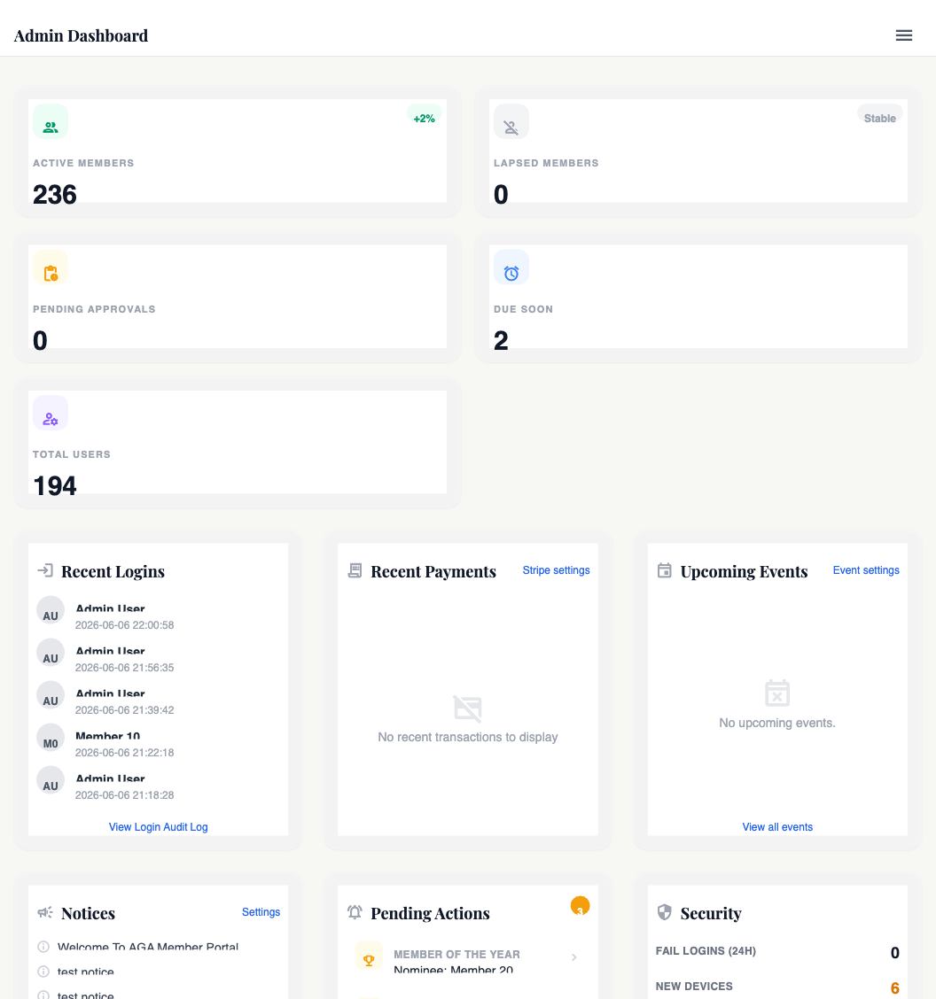

# System overview & architecture

## What this covers

A bird's-eye view of how the Goldwing site is put together: the runtime, the request lifecycle, where code lives, how environments are separated (local → draft → live), and which big subsystems exist. Read this before any other chapter — every later chapter assumes you know roughly where things plug in.

## Why it exists

The site is a single PHP application that runs on shared cPanel hosting. We picked that stack deliberately:

- **cPanel + MySQL is what the Goldwing association already pays for** — moving to a Node/Rails/Django stack would mean a new hosting bill and a new ops story.
- **No framework** — the codebase is plain PHP 8 with a tiny in-house service layer. A framework would add an upgrade treadmill and a learning curve every admin/dev would have to climb. The pieces we'd want from a framework (routing, ORM, templating) are small enough to write directly.
- **Single repo for everything** — `app/` (logic), `public_html/` (the document root cPanel serves), `database/` (migrations), `config/` (env-aware config), `cron/` (scheduled jobs), `scripts/` (one-off and tooling). One push deploys everything coherently.

The trade-off is that there's no router, no controllers in the framework sense, no migrations runner — each `*.php` file under `public_html/` *is* a route, and migrations are SQL files run manually on the server. That's documented in [Chapter 33 — Deployment](view.php?slug=33-deployment) and [Chapter 03 — Database & migrations](view.php?slug=03-database-migrations).

## How it works

### The runtime

- **Language:** PHP 8.3+ (cPanel auto-selects). Local dev uses MAMP's `php8.3.30`.
- **Database:** MySQL (cPanel-managed). Schema lives in `database/*.sql`. 43 tables at last count.
- **Sessions:** PHP sessions stored in MySQL via a custom handler (`App\Services\DbSessionHandler`), so they survive across cPanel's load-balanced PHP-FPM workers and let admins log everyone out via a table delete if needed.
- **Front-end:** server-rendered HTML + Tailwind via the Tailwind CDN (`https://cdn.tailwindcss.com?plugins=forms,typography`). No build step. Material Icons Outlined for icons.

### The request lifecycle

Every public-facing PHP file follows the same shape:

```php
require_once __DIR__ . '/../app/bootstrap.php';   // env, session, security headers
require_login();                                  // or require_role(['admin']);
// …page logic…
require __DIR__ . '/../app/Views/partials/backend_head.php';  // for admin pages
// …HTML…
require __DIR__ . '/../app/Views/partials/backend_footer.php';
```

`app/bootstrap.php` is the central entry point — it:

1. Loads `.env` and `.env.local` via `App\Services\Env`.
2. Registers a PSR-4-style autoloader for `App\` classes under `app/`.
3. Loads `config/app.php`.
4. Configures session cookies (Strict SameSite, HttpOnly, Secure on HTTPS) and swaps the session save handler to `DbSessionHandler`.
5. Starts the session.
6. Applies security headers via `App\Services\SecurityHeadersService`.
7. Defines the global helpers — `db()`, `config()`, `current_user()`, `require_login()`, `require_role()`, `require_stepup()`, `e()`.
8. Sets the timezone from `site.timezone` setting (default `Australia/Sydney`).
9. Force-HTTPS redirect if `security.force_https` is enabled.
10. Maintenance-mode shortcut: if `advanced.maintenance_mode` is on, non-admin requests get a 503 page.

The two functions that gate access on almost every page are `require_login()` and `require_role(['admin'])`. Sensitive actions additionally call `require_stepup()` — see [Chapter 06 — 2FA, step-up & trusted devices](view.php?slug=06-2fa-stepup).

### The high-level layout

```
Goldwing Website/
├── app/                          ← all PHP outside the web root
│   ├── bootstrap.php             ← every request starts here
│   ├── Services/                 ← 68 service classes (business logic)
│   ├── Views/partials/           ← shared header / sidebar / footer
│   ├── ThirdParty/               ← stripe-php, fpdf (vendored)
│   └── storage/logs/             ← runtime logs
├── public_html/                  ← cPanel document root
│   ├── index.php                 ← public homepage + CMS pages
│   ├── login.php, logout.php     ← auth entrypoints
│   ├── admin/                    ← admin console (gated by role)
│   ├── member/                   ← logged-in member area
│   ├── store/                    ← members-only storefront
│   ├── api/                      ← server-to-server endpoints (webhooks)
│   └── assets/                   ← JS, CSS, images
├── config/
│   ├── app.php                   ← static config + env wiring
│   ├── database.php              ← DB credentials
│   └── tour-manifest.json        ← UI walkthrough manifest
├── database/                     ← schema + module SQL files
├── cron/                         ← scheduled jobs (renewals, FIM, etc.)
├── scripts/                      ← tooling (impact checks, importers)
└── .cpanel.yml                   ← cPanel deploy hook
```

Two paths matter most day-to-day:

- **`app/Services/`** — almost every feature has a `FooService` class. When you want to know how something works, start there. The 68 services include `AuthService`, `StripeService`, `RefundService`, `SettingsService`, `MembershipService`, `PageBuilderService`, `NotificationService`, `TwoFactorService`, etc. See [Chapter 02 — Codebase map](view.php?slug=02-codebase-map) for the full grouped list.
- **`public_html/admin/`** — the admin UI. Each sub-folder is a section (members, store, settings, page-builder, security, help). New admin pages get added here.

### Environments

| Environment | URL | Where the code is | How it updates |
|---|---|---|---|
| Local | `localhost` via MAMP | This repo on Pat's laptop | Edit files directly |
| Draft / staging | `https://draft.goldwing.org.au` | `/home/goldwing/draft.goldwing.org.au` on cPanel | `git push origin main` → cPanel "Update from Remote" → "Deploy HEAD Commit" |
| Live | (currently same host as draft until production cut-over) | Same cPanel account | Same flow as draft |

Pat triggers deploys manually from cPanel after a push. **Never use FTP** — see [Chapter 33 — Deployment](view.php?slug=33-deployment).

### The big subsystems

Each of these owns a part of the site and gets its own chapter. This is the index:

| Subsystem | Where it lives | Chapter |
|---|---|---|
| Auth, sessions, password policy | `app/Services/AuthService.php`, `public_html/login.php` | [05](view.php?slug=05-authentication) |
| 2FA + step-up + trusted devices | `app/Services/TwoFactorService.php`, `StepUpService.php` | [06](view.php?slug=06-2fa-stepup) |
| Roles & permissions | `app/Services/SecurityPolicyService.php`, `/admin/settings/access-control.php` | [07](view.php?slug=07-roles-permissions) |
| Activity & audit log | `app/Services/ActivityLogger.php`, `AuditService.php` | [08](view.php?slug=08-activity-audit) |
| Security headers, encryption, FIM | `SecurityHeadersService`, `CryptoService`, `FileIntegrityService` | [09](view.php?slug=09-security-headers)–[11](view.php?slug=11-file-integrity) |
| Stripe payments, refunds, invoices | `app/Services/StripeService.php`, `RefundService.php`, `InvoiceService.php` | [13](view.php?slug=13-stripe-overview)–[18](view.php?slug=18-invoices) |
| Memberships & renewals | `app/Services/MembershipService.php`, `cron/expire_memberships.php` | [19](view.php?slug=19-membership-lifecycle) |
| Members admin console | `public_html/admin/members/`, `AdminMemberAccess` | [20](view.php?slug=20-members-admin) |
| Notifications & email | `app/Services/EmailService.php`, `SmtpMailer.php` | [22](view.php?slug=22-notifications-email) |
| Pages, navigation, AI page builder | `PageService`, `PageBuilderService`, `AiService` (kie.ai) | [23](view.php?slug=23-pages-navigation)–[24](view.php?slug=24-ai-page-builder) |
| Store | `public_html/admin/store/`, `OrderService` | [27](view.php?slug=27-store-architecture)–[30](view.php?slug=30-catalogue-import) |
| Settings Hub | `SettingsService`, `settings_global` / `settings_user` tables | [31](view.php?slug=31-settings-architecture)–[32](view.php?slug=32-settings-by-section) |
| Tours (UI walkthroughs) | `TourService`, `config/tour-manifest.json` | [36](view.php?slug=36-tours-system) |

## Where to change it

Most of these are admin pages — you change behaviour through the UI, and the underlying code reads the change out of the `settings_global` table. The exceptions are:

- **`config/app.php`** — for things that *can't* live in a database (the Stripe secret-key fallback, Google/Apple OAuth credentials, default AI model). Edit on disk and redeploy.
- **`.env` / `.env.local`** — `APP_KEY` (used for encrypting Stripe keys at rest), `KIE_API_KEY`, `AI_DEFAULT_MODEL`, OAuth env overrides. **Never commit `.env*` to git.**
- **`config/database.php`** — DB host, name, user, password. Edited per environment on the server.

## Settings

This chapter doesn't own any settings of its own — but every other chapter does, and they all live in the same place. Two tables back the entire Settings Hub:

- `settings_global` — site-wide, namespaced by `category` and `key_name`, value stored as JSON. Example: `site.timezone`, `security.force_https`, `payments.stripe.secret_key` (encrypted), `advanced.maintenance_mode`.
- `settings_user` — per-user preferences (email opt-outs, etc).

Reads go through `App\Services\SettingsService::getGlobal('site.timezone', 'Australia/Sydney')` and writes go through the same service, which also stamps the change into `audit_log`. See [Chapter 31 — Settings architecture](view.php?slug=31-settings-architecture).

## Screenshots

<!-- SCREENSHOT: Admin dashboard at /admin/index.php, showing the sidebar with all major sections. Capture as draft.goldwing.org.au logged in as admin. Save to public_html/admin/help/images/01-admin-dashboard.png and uncomment the line below. -->
<!--  -->

<!-- SCREENSHOT: The Settings Hub landing page at /admin/settings/. Same instructions. Save as 01-settings-hub.png. -->
<!--  -->

## Gotchas

- **The same `bootstrap.php` runs on every request** — including `/api/stripe_webhook.php`. That means Stripe webhooks go through session setup. If you ever see "stripe webhook can't read session" weirdness, it's because the request *does* have a session — it's just that Stripe doesn't send a cookie, so it's a fresh empty session.
- **No HTTP routing layer.** `/admin/members/index.php` is a real PHP file at that path. Renaming a file breaks the URL. When you move things, leave a redirect stub (or add an Apache rewrite in `.htaccess`).
- **Tailwind is loaded from the CDN.** No build step is great for speed but means we can't use Tailwind plugins that require config-file changes. If we ever need a custom plugin, the path is to vendor a compiled CSS file under `public_html/assets/`.
- **`config()` re-reads `config/app.php` every call.** That was a conscious shortcut (always fresh in dev). If we ever profile and find that's hot, cache it in a static.
- **Two session SameSite values exist.** `bootstrap.php` sets `Strict` for the cookie params; `config/app.php` declares `Lax`. The bootstrap value wins because it's set after the config load. Don't be confused by the config entry — it's vestigial.

## Related chapters

- [02 — Codebase map](view.php?slug=02-codebase-map) — every folder, every services file, what's in it.
- [03 — Database & migrations](view.php?slug=03-database-migrations) — schema, migration approach, the SQL files.
- [04 — Configuration & environment](view.php?slug=04-configuration) — `.env`, `config/app.php`, what overrides what.
- [33 — Deployment](view.php?slug=33-deployment) — the "push live" flow end-to-end.
- [A — Decision log](view.php?slug=A-decision-log) — why no framework, why kie.ai, why custom 2FA.
