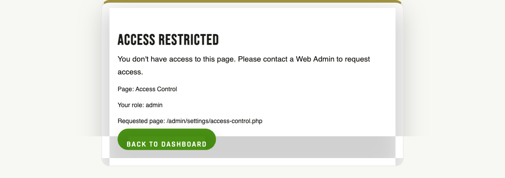

# Roles & permissions

## For administrators

### What this is

Every admin user has one or more **roles**. A role decides which menu items they see and which buttons they can click. We use roles to make sure only the right people can do sensitive things — the Treasurer can issue refunds but can't change SMTP settings; an Area Rep can see their chapter's members but not the whole national list.

Most committee members have **one** role. Some people wear several hats and hold **two or three**. That's fine — the system stacks them, so if any one of your roles allows a thing, you can do that thing.

### The built-in roles, in plain English

- **Admin** — full access. Can do anything in the admin area, including changing other people's roles. Use sparingly. Reserve it for the site administrator and one or two committee officers who genuinely need everything.
- **Webmaster** — technical maintainer. Same access as Admin in practice, but conceptually separate so we can tell at a glance who's the "tech person" vs. the committee. Often the developer or whoever looks after the website day-to-day.
- **Committee Member** — general admin. Can approve membership applications, issue refunds, see the members list, run reports. Cannot change site-wide settings or roles. The default for elected committee members who aren't the President or Treasurer.
- **Treasurer** — payments-and-refunds focus. Can issue refunds, see payment history, run financial reports. Doesn't need access to content editing or site settings.
- **Store Manager** — store CRUD only. Adds products, fulfils orders, manages stock. Doesn't see members or settings. Good for a quartermaster volunteer.
- **Area Rep** — chapter-scoped. Sees only their own chapter's members, not the whole national list. Used by chapter leaders.
- **Member** — the default for every paying member. Gates the member portal and the store. This is what the public-facing members hold.

### Who's allowed to change roles

**Admins only.** Changing someone's role is a sensitive action — if you're not an Admin, you won't see the option. Ask the site administrator.

### Where to find it in admin

{{link:/admin/settings/?section=accounts|Take me to Accounts & Roles}}

Three different screens, depending on what you're trying to do:

- **Admin → Settings → Accounts & Roles** — the main "who is what" list. Pick a person, tick the roles they should have.
- **Admin → Settings → Admin Role Builder** — for creating a brand-new custom role or editing what an existing role can do (which permissions it has).
- **Admin → Settings → Access Control** — for fine-tuning which URLs each role can reach, without changing code.

### How to give someone a role

{{tour:admin-find-edit-member}}

Two routes, same result:

1. **From a member's profile** — Admin → Members → click the person → role section → tick the role(s) → Save.
2. **From the roles screen** — Admin → Settings → Accounts & Roles → find the user → tick the role(s) → Save.

If they already have a role, just add or remove. A user can hold more than one role; the system uses the most permissive combination.

### How to create a new custom role

{{link:/admin/settings/roles.php|Take me to the Admin Role Builder}}

If none of the built-in roles fit (e.g. you want a "Welfare Officer" who can see members and send emails but nothing else):

1. Admin → Settings → **Admin Role Builder**.
2. Click **New role**.
3. Give it a clear name (e.g. *Welfare Officer*).
4. Tick the **permissions** this role should have — each permission is a single capability like "view members" or "issue refunds".
5. Save.
6. Then go to **Accounts & Roles** and assign the new role to the right people.

The built-in roles (Admin, Treasurer, etc.) can be renamed or have their permissions adjusted, but they can't be deleted — they're load-bearing.

### What can go wrong (and what to do)

- **You remove your own admin role and lock yourself out.** The system *tries* to stop you (you'll usually see a warning), but it's possible. Recovery means another admin restoring your role, or a developer fixing it in the database. **Always have at least two Admin accounts** so you never have a single point of failure.
- **You give someone too much access.** Easily fixed — go to Accounts & Roles, untick the role. The next time they load a page, they'll lose access. No harm done as long as you catch it quickly. Check the activity log to see what they did in the meantime.
- **Two roles conflict.** Roles always *combine* (most permissive wins). So if someone has both "Store Manager" and "Treasurer", they get the union of both. There's no way for one role to *block* another. If you need to take an ability away, remove the role that grants it.
- **An Area Rep sees no members at all.** Their account isn't linked to a member row, so the system doesn't know which chapter they belong to. Edit their user record and link it to their member profile.
- **An empty custom role can do nothing.** Not even view the dashboard. If you create a new role and forget to tick any permissions, anyone assigned to it will see a blank admin area. Tick at least `admin.dashboard.view`.

### What gets recorded

Every role change is logged:

- **In the activity log** — Admin → Security Log. Search for `role` to see every assignment, creation, or removal, plus who did it.
- **On the user's record** — the current roles are visible on their profile.

This means if a permission incident ever comes up, you can reconstruct who had what, when.

### Good practice

- **Principle of least privilege.** Give people only what they need to do their job. It's tempting to make everyone Admin "to save time" — don't. The five minutes you save now costs you a much bigger problem later.
- **Review role assignments once a year.** Committee changes, people step down, volunteers move on. Take 30 minutes after the AGM to walk through Accounts & Roles and prune anyone who shouldn't still have access.
- **Never use a personal account for a shared role.** If the Treasurer's account is `john.smith@example.com` and John steps down, the next Treasurer inherits John's email, his 2FA setup, his sign-in history. Use a role-named account (`treasurer@goldwing.org.au`) for shared positions, or rotate properly when the role changes hands.
- **Two Admins, always.** Never have only one Admin account. If that account gets locked, you'll need a developer to recover.
- **Keep the Webmaster role for actual tech work.** Don't hand it out as a generic "trusted person" badge — that defeats the point of having it as a separate role.

### Who to ask if you're stuck

- **Can't assign a role** — you're probably not Admin. Ask the site administrator.
- **Created a custom role and it's not working** — check you ticked at least one permission, and that the person has been assigned the role on Accounts & Roles.
- **Need a permission that doesn't exist yet** — developer task. The list of available permissions is hard-coded in the system; new ones need a code change.
- **Locked yourself out** — flag a developer with another committee member's account so they can restore your access.

---

<details>
<summary><strong>Dev notes</strong></summary>

### What this covers

How we decide what a logged-in user can see and do — the role-based access control (RBAC) system. Two things sit at the centre:

1. **Roles** — buckets we put users in (`admin`, `area_rep`, `store_manager`, `member`, plus aliases like `webmaster` and `committee`).
2. **Permission keys** — granular capabilities like `admin.payments.refund`. Roles "have" permissions; pages ask "does this user have that permission?"

Layered on top is **path-level access control** so pages can be opened or closed by URL without touching code.

### Why it exists

Goldwing is run by volunteers wearing several hats, and we wanted least-privilege without making every change a developer ticket.

- **The treasurer needs to issue refunds, but should not change SMTP settings.**
- **An area rep should see and edit *their chapter's* members — not the whole national list.**
- **A store-only volunteer should fulfil orders without seeing financial reports.**
- **The webmaster should edit pages and read the audit log without touching payments.**

A single-role system would force us to either grant too much (give the treasurer "admin") or write bespoke checks in every file. Permission keys plus a UI let committee members self-serve onboarding a new volunteer at the right level.

### How it works

#### Where roles are stored

Three database tables:

- `roles` — one row per role, with `is_system` and `is_active` flags.
- `user_roles` — join table linking `users.id` to `roles.id`. A user can hold multiple roles.
- `role_permissions` — per-role grants (`role_id`, `permission_key`, `allowed`).

At login, `App\Services\AuthService::getUserRoles()` queries the join and stuffs the resulting **array of role-name strings** onto `$_SESSION['user']['roles']`. So in PHP, `$user['roles']` is always a plain array like `['admin', 'area_rep']` — not a JSON column, not comma-separated.

#### The built-in roles

| Role | Used for |
|---|---|
| `admin` | Full access. Committee members and the site administrator. |
| `webmaster` | Legacy/alias role still used by hard-coded checks in `/admin/help/*` and `TourService` — normalised to `admin`. |
| `store_manager` | Quartermaster — products, orders, fulfilment. No member or settings access. |
| `area_rep` | Chapter-scoped: sees only their own chapter's members. See [Chapter 21](view.php?slug=21-chapters-area-reps). |
| `member` | Every logged-in member. Gates `/member/` and the store. |
| `committee` | Alias for `admin`. Old data may still hold this string. |

#### Permission keys

Defined in `includes/admin_permissions.php → admin_permission_registry()`, grouped into eight categories — a representative sample:

- **Core Admin** — `admin.dashboard.view`, `admin.users.view/create/edit/disable`, `admin.roles.view/manage`
- **Membership** — `admin.members.view/edit/renew`, `admin.members.manual_payment`, `admin.members.import_export`, `admin.payments.view/refund`
- **Store / Orders** — `admin.store.view`, `admin.products.manage`, `admin.orders.view/fulfil/refund_cancel`
- **Content / Pages** — `admin.pages.view/edit/publish`, `admin.media_library.manage`, `admin.wings_magazine.manage`
- **Events / Calendar** — `admin.calendar.view/manage`, `admin.events.manage`
- **Notification Hub** — `admin.requests.view/action`
- **Builders / Tools** — `admin.ai_page_builder.access/edit/publish`, `admin.settings.general.manage`, `admin.logs.view`, `admin.integrations.manage`

The registry is the source of truth for the role builder UI — add a key here and it shows up as a new checkbox next page load.

#### The helpers you'll see everywhere

`current_admin_can($permissionKey, $user = null)` — in `includes/admin_permissions.php`. Joins the user's roles to `role_permissions`, returns true/false. Used inline for menu items, button visibility, and per-action checks.

```php
if (current_admin_can('admin.payments.refund')) {
    echo '<button>Refund</button>';
}
```

`require_permission($permissionKey)` — `require_login()` then `current_admin_can()`. On failure: `/api/*` and JSON requests get `{"error":"Forbidden"}`; HTML requests go through `admin_render_forbidden()`, which redirects users with **no** admin permissions straight back to `/member/index.php` (so plain members never see the admin shell) and only renders the 403 card for partial-admin roles (e.g. a webmaster hitting a page they don't have). Use at the top of any permission-gated admin page.

`require_role(['admin'])` — in `app/bootstrap.php`. Hard role gate; bypasses the permission registry entirely. Used by older code, by `/admin/help/*` pages (which check `['admin', 'webmaster']`), and as a backstop on the most sensitive pages.

`can_access_path($userOrRoles, $path)` — in `includes/access_control.php`. Looks the path up in `pages_registry`, joins to `page_role_access`. The engine behind the Access Control page.

`normalize_access_roles($roles)` — lower-cases, trims, resolves aliases (`chapter_leader`→`area_rep`, `treasurer`→`admin`, `committee`→`admin`, `super_admin`→`admin`, …). Always pipe untrusted role lists through this before comparing.

#### Area reps and `AdminMemberAccess`

`App\Services\AdminMemberAccess` is the per-action access service for the Members console. It answers "can this admin do *this thing* to *this member record*?" The verbs (`canEditProfile`, `canResetPassword`, `canRefund`, `canImpersonate`, etc.) delegate to `current_admin_can()`. The one extra rule is `getChapterRestrictionId($user)` — it returns the chapter id an `area_rep` is locked to, or `null` for full-access roles. Members queries filter by that id, so area reps literally cannot see members from other chapters. See [Chapter 21](view.php?slug=21-chapters-area-reps).

### Where to change it

- **Admin → Settings → Admin Role Builder** (`/admin/settings/roles.php`) — create new roles and tick/untick permissions. Saved by `/admin/settings/roles-save.php`. System roles can be renamed but not deleted.
- **Admin → Settings → Access Control** (`/admin/settings/access-control.php`) — pick a role, then allow/deny each registered page path. Pages and patterns are auto-synced from the codebase by `sync_access_registry()` on each page load.
- **Admin → Settings → Accounts & Roles** (`/admin/settings/index.php?section=accounts`) — assign roles to specific users.
- **Code** — add a new permission key in `includes/admin_permissions.php` (`admin_permission_registry()`), then reference it via `current_admin_can()` or `require_permission()`.

### Settings

This chapter doesn't own any `settings_global` keys. The role/permission tables (`roles`, `user_roles`, `role_permissions`, `pages_registry`, `page_role_access`) are their own storage and are edited through the UIs above.

### Gotchas

- **`webmaster` is half-alive.** `normalize_access_role()` aliases it to `admin`, but a handful of files — `TourService.php`, `/admin/help/edit.php`, `/admin/help/docs/view.php`, `help_button.php`, `api_steps.php` — still do `in_array('webmaster', $user['roles'])` directly. If you ever rename or remove `webmaster`, grep for the literal string first.
- **Adding a permission key is two steps.** Append it to `admin_permission_registry()` *and* tick it on the relevant role in `/admin/settings/roles.php` (or seed via `admin_default_role_permissions()`). Forget step two and no one — not even admins — has the new permission.
- **Roles are checked in TWO places.** `backend_admin_sidebar.php` filters menu items via `current_admin_can()`, *and* each page should also call `require_permission()` or `require_role()`. Hiding a menu item is **not** a security control — anyone who knows the URL can hit it if the page doesn't gate itself.
- **`committee` lingers in old data.** A migration dropped `committee`, `treasurer`, `webmaster`, `super_admin`, `membership_admin`, `store_admin`, `content_admin` from `roles`, but imports and integrations may still send these strings. `normalize_access_roles()` is what saves us.
- **An empty custom role can do nothing** — not even see the dashboard.
- **`require_role(['admin'])` ignores the permission registry.** Intentional — it's the backstop for the highest-stakes pages. But a custom "Membership Admin" role with every `admin.*` permission ticked will still *not* pass a `require_role(['admin'])` check. Use `require_permission()` for fine-grained gating; reserve `require_role()` for break-glass pages.
- **`area_rep` scoping depends on `users.member_id`.** If the area-rep account isn't linked to a member row, `getChapterRestrictionId()` returns `null` and they see *no* members at all.

</details>

<!-- SCREENSHOT: /admin/settings/roles.php with a custom role selected, permission checkboxes visible. Save as 07-role-builder.png. -->
<!--  -->

<!-- SCREENSHOT: /admin/settings/access-control.php with role=area_rep selected, showing the allow/deny matrix. Save as 07-access-control.png. -->
<!--  -->

## Related chapters

- [05 — Authentication & sessions](view.php?slug=05-authentication) — how roles get loaded onto the session at login.
- [06 — 2FA, step-up & trusted devices](view.php?slug=06-2fa-stepup) — `SecurityPolicyService` reads roles to decide who must enrol.
- [08 — Activity & audit log](view.php?slug=08-activity-audit) — role and permission changes are stamped to `audit_log`.
- [17 — Refunds](view.php?slug=17-refunds) — gated by `admin.payments.refund`.
- [20 — Members admin console](view.php?slug=20-members-admin) — where `AdminMemberAccess` is consumed.
- [21 — Chapters & area reps](view.php?slug=21-chapters-area-reps) — full chapter-scoping detail.
- [31 — Settings architecture](view.php?slug=31-settings-architecture) — gated by `admin.settings.general.manage`.
