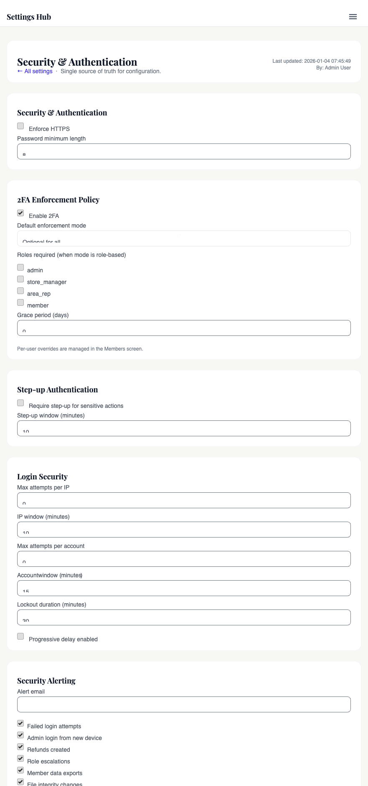

# Security headers & policies

## For administrators

### What this is

There are three kinds of security setting on this page, and they all do different jobs:

- **Invisible safety rules** the browser enforces on every page (you don't touch these — they're set in code and shipped with a deploy).
- **The 2FA policy** that decides who has to use 2FA and who doesn't.
- **Login rate limits** that decide how many wrong-password attempts we tolerate before locking someone out.

You won't see the invisible browser rules anywhere in admin — they just run. The 2FA policy and the login limits are the knobs on this page.

### What it lets you do

- Turn 2FA enforcement on or off, globally or per role.
- Set the minimum password length everyone has to use.
- Toggle "Force HTTPS" so the site always redirects to the secure version of every URL.
- Tune the "step-up window" — how long after entering a 2FA code the system trusts you for sensitive actions (refunds, role changes, etc.).
- Set how many failed logins trigger a lockout, and for how long.

### Who's allowed

**Admin** only. These settings can lock the entire site (or you) out if mis-set, so they're admin-gated by design.

### Where to find it in admin

Admin → **Settings** → **Security & Authentication**.

### The settings on this page, explained

#### Enforce HTTPS

When **on**, every plain HTTP request is automatically redirected to its `https://` equivalent. This is what you want in production — it stops a member's password ever travelling unencrypted.

Leave it **off** if you're testing on a server without a valid SSL certificate, otherwise you'll lock yourself in a redirect loop. On the live site (`goldwing.org.au` and `draft.goldwing.org.au`), it should always be on.

#### Password minimum length

The shortest password the system will accept. Default is **12 characters**. You can raise it (recommended for higher security) but you can't go below 1.

Raising this doesn't kick existing members off — their current passwords still work. It only applies to new passwords (signups, resets, changes).

#### 2FA enforcement mode

Four modes, in plain English:

- **Disabled** — nobody is forced to use 2FA. They can still turn it on themselves if they want.
- **Optional** — same as Disabled in practice; 2FA is offered, never required.
- **Required for specific roles** — only certain roles (e.g. Admin, Committee) have to use 2FA. Everyone else is optional. You pick which roles in the next setting.
- **Required for all** — every member has to set up 2FA before they can log in.

The recommended setting for live operations is **Required for specific roles**, with at least Admin selected. **Required for all** is the strictest — fine for an association that's been hit with phishing attempts, harder on members who don't carry a smartphone.

#### Roles required for 2FA

Only shown when the mode above is "Required for specific roles". Tick every role that must use 2FA. **Admin** should always be ticked. Most committees also tick **Committee Member** and **Treasurer**.

#### Grace period (days)

When 2FA is required, brand-new accounts get this many days to enrol before they're forced to. Default is **0** — meaning they're prompted on first login. Set it to e.g. **7** if you want to give new members a week to set things up before the wall goes up.

The grace period is measured from **the date the account was created**, not from today. So bumping it from 0 to 30 does **not** give all existing members 30 more days — it only helps people who signed up in the last 30 days.

#### Step-up window (minutes)

Sensitive actions (issuing a refund, changing someone's role, exporting member data) ask for a fresh 2FA code even after you're already logged in. The step-up window is how long that fresh code stays valid before you have to enter another one.

- Default is **10 minutes**.
- Set it shorter (e.g. 2 minutes) for stricter security — but you'll be re-entering codes a lot.
- Set it longer (e.g. 30 minutes) if the constant prompts are driving the committee crazy — but understand that a logged-in admin's laptop becomes a refund-issuing machine for that long if they walk away.

#### Login security (cross-ref Chapter 12)

Four knobs that decide when someone gets locked out for typing the wrong password too many times:

- **Max attempts per IP** — how many failed logins from one network address before that address is throttled. Default **10**.
- **Max attempts per account** — how many failed logins on one user account before the account is temporarily locked. Default **5**.
- **Lockout duration (minutes)** — how long the lockout lasts. Default **30 minutes**.
- **Progressive delay** — adds a small delay after each failed attempt, so a brute-force script slows down even before the lockout kicks in.

For more detail on what triggers these and how to unlock a stuck account, see [Chapter 12 — Login rate limiting & lockout](view.php?slug=12-rate-limit-lockout).

### Common things you'll do

- **Force 2FA for admins.** Set mode to "Required for specific roles", tick Admin (and Treasurer, Committee Member if you want).
- **Bump the password minimum length.** Change the number, save. Existing passwords keep working; new ones must be at least the new length.
- **Turn on Force HTTPS after testing.** On the live site, leave it on. On a fresh staging server without a certificate, leave it off until the certificate is installed.
- **Widen the step-up window if it's annoying everyone.** Push it from 10 to 20 or 30 minutes. Don't go higher than 30 unless you have a good reason.
- **Tighten lockout after a brute-force spike.** Drop max attempts per IP from 10 to 5, raise lockout duration from 30 to 60 minutes.

### What can go wrong

- **You lock yourself out by turning 2FA on without enrolling first.** If you flip "Required for all" before setting up 2FA on your own account, you'll be bounced to the 2FA enrolment page on next login. Usually fine — but if your enrolment is broken (lost phone, app re-installed), you may need another admin to remove the 2FA requirement on your account temporarily.
- **Force HTTPS breaks something.** If your staging server's SSL certificate is invalid or missing, turning Force HTTPS on creates a redirect loop. Turn it off, fix the certificate, turn it back on.
- **Step-up window too short.** If you've set it to 2 minutes, expect to type your 2FA code every few clicks during a busy admin session. Bump it back up.
- **Lockout too aggressive.** If you've dropped "max attempts per account" to 2, legitimate members who fat-finger their password twice will be locked out for 30 minutes. Find the balance.
- **You change a setting that breaks the staging-vs-live difference.** These settings live in the database, so if you tested with "Force HTTPS off" on staging and forget to flip it back on live, the live site stops redirecting to HTTPS. Always re-check after copying a database between environments.

### What gets recorded

Every change to this settings page is written to the activity log — who changed which setting, when, and what the old/new values were. Search the activity log for `security.settings_updated` to see the history. See [Chapter 08 — Activity & audit log](view.php?slug=08-activity-audit).

Failed logins, lockouts, and step-up attempts also log their own events — those are useful when investigating a member who's complaining they can't get in.

### Good practice

- **Don't turn off 2FA enforcement** unless you're actively debugging a problem with it, and turn it straight back on afterwards. 2FA is the single biggest defence against a phished password.
- **Rotate admin passwords annually.** The system doesn't force this, but it's a sensible policy. Set yourself a calendar reminder.
- **Review this settings page once a quarter.** A 5-minute glance — is 2FA still required? Is Force HTTPS still on? Is the lockout still sensible? Has anyone added a new role we should require 2FA for?
- **Don't widen lockout to the point of being useless.** "Max attempts per account = 999" effectively turns off brute-force protection. If you're tempted, ask why — the answer is usually "an automated test or monitoring script is hitting the login endpoint", which should be fixed at the script, not by lowering the security bar.

### Who to ask if stuck

- **I locked myself out of 2FA** — ask another admin to set your 2FA override to "EXEMPT" temporarily so you can log in and re-enrol.
- **Force HTTPS broke the site** — your developer or hosting admin can fix the SSL certificate.
- **I want to whitelist a new third-party script (Google Analytics, a chat widget, etc.)** — that's a developer task. The list of allowed external scripts isn't in this settings page; it's in code and needs a deploy.

---

<details>
<summary><strong>Dev notes</strong></summary>

### What this covers

Every HTTP response the site sends carries a stack of security headers — Content-Security-Policy, X-Frame-Options, HSTS, Referrer-Policy, Permissions-Policy, X-Content-Type-Options. This chapter explains what each one says, why it's set the way it is, and which knobs are in code versus the Settings Hub. It also covers the two services that decide *who* needs 2FA and *how aggressive* the lockout policy is: `SecurityPolicyService` and `SecuritySettingsService`.

If you're trying to add a new third-party script (e.g. a new analytics CDN), this is the chapter — you'll be editing `SecurityHeadersService` directly, because CSP source lists live in PHP, not in the database.

### Why it exists

Browsers will execute almost anything an HTML page asks them to unless we tell them otherwise. The headers here are the "tell them otherwise" — they're the difference between an XSS bug being an inconvenience and an XSS bug exfiltrating session cookies.

A few deliberate choices shaped the current implementation:

- **CSP source lists are in PHP, not in the DB.** Letting an admin add an arbitrary script source through a form is one CSRF away from someone whitelisting their own attacker-controlled CDN. The CSP is code-reviewed and deployed; that's the gate.
- **2FA enforcement and lockout thresholds *are* in the DB.** These are operational tuning knobs (lock people out faster after a brute-force spike, exempt one admin during a recovery) and need to change without a deploy.
- **One central place applies all headers.** `SecurityHeadersService::apply()` runs from `app/bootstrap.php` so every PHP entrypoint gets the same treatment automatically — there's no "this admin page forgot its CSP" failure mode.

### How it works

#### The headers themselves

`app/Services/SecurityHeadersService.php` is one static method, `apply()`, called from `app/bootstrap.php` line 49 — right after the session is started and before any page logic. It bails out early if `headers_sent()` is true (so an accidental `echo` before bootstrap doesn't crash the request).

The headers it sets:

| Header | Value | Purpose |
|---|---|---|
| `Content-Security-Policy` | composed below | What the page is allowed to load and execute |
| `X-Frame-Options` | `DENY` or `SAMEORIGIN` | Legacy framing protection (CSP `frame-ancestors` is the modern one; we set both for old browsers) |
| `X-Content-Type-Options` | `nosniff` | Stops browsers guessing MIME types — protects against polyglot uploads |
| `Referrer-Policy` | `strict-origin-when-cross-origin` | Leak the path within Goldwing, leak only the origin to outside sites |
| `Permissions-Policy` | `geolocation=(), microphone=(), camera=(), payment=()` | Tells the browser no page on this site may use these APIs (Stripe Elements has its own postMessage path and doesn't need the Payment Request API) |
| `Strict-Transport-Security` | `max-age=63072000; includeSubDomains; preload` | Only set when the request is already HTTPS; locks browsers into HTTPS for 2 years |

#### The CSP, broken down

The CSP is built up from variables for readability. The current directives:

```
default-src 'self';
img-src 'self' data: https:;
style-src 'self' 'unsafe-inline' https://fonts.googleapis.com [+ jsdelivr on framed pages];
script-src 'self' 'unsafe-inline' https://cdn.tailwindcss.com https://cdn.jsdelivr.net
           https://cdnjs.cloudflare.com https://maps.googleapis.com https://maps.gstatic.com
           https://js.stripe.com https://m.stripe.network;
frame-src 'self' https://js.stripe.com https://m.stripe.network;
font-src 'self' data: https://fonts.gstatic.com;
connect-src 'self' https://api.stripe.com https://m.stripe.network
            https://maps.googleapis.com https://maps.gstatic.com
            https://cdnjs.cloudflare.com https://cdn.jsdelivr.net;
worker-src blob: https://cdnjs.cloudflare.com;
frame-ancestors 'none' | 'self';
```

`'unsafe-inline'` is in `script-src` and `style-src` because Tailwind's CDN injects styles inline and a lot of admin pages use inline `onclick` handlers. Removing it is a long-term cleanup task, not a quick toggle.

`frame-ancestors` is the per-page override: two paths are allowed to be iframed — `/calendar/events_public.php` (so chapters can embed the events calendar on their own sites) and `/admin/page-builder/preview.php` (so the page builder can render previews in an iframe). Everything else gets `'none'`. The toggle is the in-line `$allowFraming` check at the top of `apply()`.

#### `SecurityPolicyService` — who needs 2FA

`app/Services/SecurityPolicyService.php` answers one question per request: *does this user have to have 2FA enabled?* It's called from `require_login()` in `bootstrap.php` and from the admin user-management screens.

The decision flow in `computeTwoFaRequirement(array $user)`:

1. If the global `enable_2fa` flag is off, or `twofa_mode` is `DISABLED` → return `DISABLED`.
2. If mode is `REQUIRED_FOR_ALL` → required.
3. If mode is `REQUIRED_FOR_ROLES` → required only if the user's roles intersect `twofa_required_roles`.
4. Per-user override (from `user_security_overrides.twofa_override`): `REQUIRED` forces it on, `EXEMPT` forces it off, `DEFAULT` leaves the role-based answer alone.
5. Return `REQUIRED` or `OPTIONAL`.

If the result is `REQUIRED` and the user hasn't enrolled yet, `require_login()` bounces them to `/member/2fa_enroll.php` — unless they're inside the grace window (`twofa_grace_days`) or have email OTP enabled as a fallback. See [Chapter 06 — 2FA, step-up & trusted devices](view.php?slug=06-2fa-stepup).

#### `SecuritySettingsService` — the cached row

All of the operational security knobs live in **one row** of the `security_settings` table (`id = 1`). `SecuritySettingsService::get()` loads it once per request (`self::$cache`), falls back to `defaults()` if the table is missing (defensive — avoids breaking the site during a half-applied migration), and seeds a fresh row if the table exists but is empty.

`SecuritySettingsService::update($actorUserId, $payload)` writes the whole row atomically, logs `security.settings_updated` to the activity log, and clears the cache.

### Where to change it

| You want to… | Edit |
|---|---|
| Add a new whitelisted script CDN | `app/Services/SecurityHeadersService.php` (`$cdnSources`, `$scriptSrc`, or a new variable) → deploy |
| Allow a new page to be iframed | Add its path to the `$allowFraming` array in `SecurityHeadersService::apply()` |
| Change the Permissions-Policy list | Edit the literal in `SecurityHeadersService::apply()` |
| Force HTTPS | Settings Hub → **Security** → "Force HTTPS" toggle (`security.force_https`) |
| Set the password minimum length | Settings Hub → **Security** → "Password minimum length" (`security.password_min_length`) |
| Tweak 2FA mode, lockout, alerts, FIM paths | Settings Hub → **Security** → 2FA / Login lockout / Alerts / File integrity sections (all backed by `security_settings`) |
| Force one user into / out of 2FA | Admin user edit screen → 2FA override (`user_security_overrides.twofa_override`) |

### Settings

Two storage backends — two flavours of setting.

**`settings_global` keys (read via `SettingsService::getGlobal`)**

| Key | Default | Allowed values |
|---|---|---|
| `security.force_https` | `false` | boolean — when true, bootstrap 301-redirects any HTTP request to HTTPS |
| `security.password_min_length` | `12` (UI), `8` (`PasswordPolicyService` fallback) | integer ≥ 1 — minimum password length enforced by `PasswordPolicyService` |

**`security_settings` row (read via `SecuritySettingsService::get`)**

| Key | Default | Allowed values |
|---|---|---|
| `enable_2fa` | `true` | boolean — global 2FA kill switch |
| `twofa_mode` | `REQUIRED_FOR_ALL` | `DISABLED`, `OPTIONAL`, `REQUIRED_FOR_ALL`, `REQUIRED_FOR_ROLES` |
| `twofa_required_roles` | `[]` | array of role names — only used when mode is `REQUIRED_FOR_ROLES` |
| `twofa_grace_days` | `0` | integer days — new accounts skip the 2FA wall for this long |
| `stepup_enabled` | `true` | boolean — whether sensitive actions require re-verification |
| `stepup_window_minutes` | `10` | integer minutes — how long a step-up stays valid |
| `login_ip_max_attempts` | `10` | integer — failed logins per IP before throttling |
| `login_ip_window_minutes` | `10` | integer minutes — sliding window for the IP counter |
| `login_account_max_attempts` | `5` | integer — failed logins per account before lockout |
| `login_account_window_minutes` | `15` | integer minutes — sliding window for the account counter |
| `login_lockout_minutes` | `30` | integer minutes — how long an account stays locked |
| `login_progressive_delay` | `true` | boolean — add increasing delay after each failed attempt |
| `alert_email` | `""` | email address — recipient for security alert emails |
| `alerts.failed_login` | `true` | boolean — email on failed-login bursts |
| `alerts.new_admin_device` | `true` | boolean — email when an admin signs in from a new device |
| `alerts.refund_created` | `true` | boolean — email on every refund |
| `alerts.role_escalation` | `true` | boolean — email when a user gains the `admin` role |
| `alerts.member_export` | `true` | boolean — email on member-data exports |
| `alerts.fim_changes` | `true` | boolean — email when FIM detects file changes |
| `alerts.webhook_failure` | `true` | boolean — email when Stripe webhooks fail repeatedly |
| `fim_enabled` | `true` | boolean — turn the file integrity scanner on/off |
| `fim_paths` | `["/app", "/admin", "/config"]` | array of paths (relative to repo root) to watch |
| `fim_exclude_paths` | `["/uploads", "/cache"]` | array of paths to skip |
| `webhook_alerts_enabled` | `true` | boolean — alert on webhook failure bursts |
| `webhook_alert_threshold` | `3` | integer — failed webhooks needed to trigger the alert |
| `webhook_alert_window_minutes` | `10` | integer minutes — sliding window for the webhook counter |

**`user_security_overrides` (per-user, set via `SecurityPolicyService::setTwoFaOverride`)**

| Column | Allowed values |
|---|---|
| `twofa_override` | `DEFAULT`, `REQUIRED`, `EXEMPT` |

### Gotchas

- **`'unsafe-inline'` is still in `script-src`.** That weakens the CSP — XSS that injects inline `<script>` will run. Moving the admin UI to nonce-based scripts is on the cleanup list; until then, the rest of the stack (CSRF tokens, input escaping via `e()`, the `frame-ancestors` lock) is the real defence.
- **Adding a CDN means editing PHP and deploying.** There is no admin UI for CSP source lists, and there shouldn't be. If you need jsdelivr for a non-framed page, add it to `$cdnSources` in `SecurityHeadersService` and ship.
- **HSTS only sets on HTTPS requests.** The `$_SERVER['HTTPS']` check is intentional — sending HSTS over plain HTTP is ignored by browsers anyway, but the check avoids surprising local-dev behaviour where HSTS would pin `localhost` to HTTPS.
- **`X-Frame-Options` and CSP `frame-ancestors` are both set.** Modern browsers use `frame-ancestors`; old ones use `XFO`. Keep both in sync if you add a new framed-allowed path — there are two places to update.
- **`SecuritySettingsService::$cache` is request-scoped.** It only lasts for one PHP request. If a CLI script (cron) calls `update()` then `get()`, it'll see the new values. If a long-running daemon ever appears, that cache would need flushing.
- **The 2FA grace period is from account creation, not from "now".** Setting `twofa_grace_days = 30` does *not* give existing users 30 more days — `AuthService::withinGracePeriod()` measures against `users.created_at`.
- **`twofa_required_roles_json` and `fim_paths_json` are JSON columns.** Querying them from SQL needs `JSON_CONTAINS` or `JSON_EXTRACT`; don't try `LIKE '%admin%'` matches in reports.

</details>

<!-- SCREENSHOT: Browser devtools Network tab on draft.goldwing.org.au showing the response headers (CSP, X-Frame-Options, HSTS, Permissions-Policy) on /admin/index.php. Save to public_html/admin/help/images/09-response-headers.png. -->
<!--  -->

<!-- SCREENSHOT: /admin/settings/index.php scrolled to the Security section showing the 2FA mode, lockout knobs, alerts checkboxes, and Force HTTPS toggle. Save as 09-security-settings.png. -->
<!--  -->

## Related chapters

- [05 — Authentication & sessions](view.php?slug=05-authentication) — `AuthService`, password policy, where these headers stop being theoretical
- [06 — 2FA, step-up & trusted devices](view.php?slug=06-2fa-stepup) — the user-facing side of the 2FA policy this chapter computes
- [10 — Encryption & secrets at rest](view.php?slug=10-encryption-secrets) — how the Stripe key and other secrets are protected at rest
- [11 — File integrity monitoring](view.php?slug=11-file-integrity) — what the `fim_*` settings here actually drive
- [12 — Login rate limiting & lockout](view.php?slug=12-rate-limit-lockout) — the runtime that reads the `login_*` knobs
- [31 — Settings architecture](view.php?slug=31-settings-architecture) — how `settings_global` vs dedicated tables (like `security_settings`) coexist
