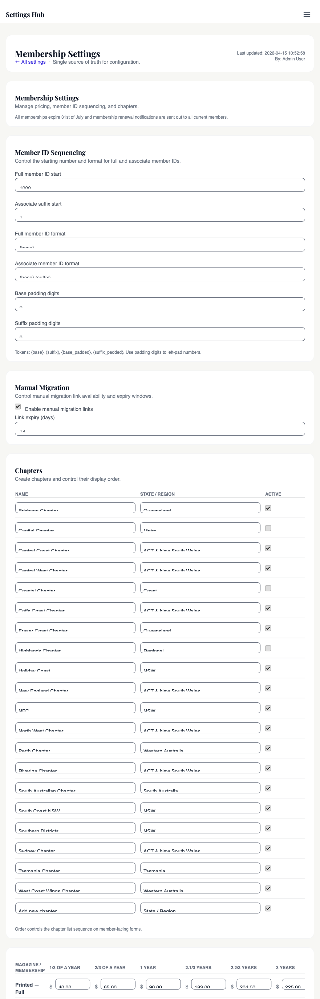

# Membership pricing matrix

## For administrators

### What this is

The **pricing matrix** is where the association sets every membership price the website charges. It's a single grid that covers all of our combinations: printed magazine vs PDF, Full member vs Associate, and the various lengths of membership someone can buy.

Every membership we sell expires on **31 July**. That's why the grid isn't just "one year, two years, three years" — it also has shorter slices for people who join part-way through the year, so they only pay for the months until the next 31 July rather than a full year they'd partly lose.

When a member goes to join, renew, or upgrade on the public site, the price they see comes straight from this grid. Change a number here and it takes effect immediately on the next checkout.

### What it lets you do

- Set the price for every combination of magazine format, membership type, and period — 24 prices in one form.
- Update prices yourself, without having to ask a developer or wait for a deploy.
- Reset the whole grid back to a sensible starting point if something gets messy.
- See the prices the way a joining member will see them at checkout.

### Who's allowed to do this

Two roles can edit the pricing matrix:

- **Treasurer**
- **Admin**

Other roles can view the Settings hub but won't see the Save button on the pricing card. If you think you should have access, ask an admin to update your role.

### Where to find it in admin


{{link:/admin/settings/?section=membership_pricing|Take me to Membership & Pricing}}

Admin → **Settings** → **Membership Settings** (in the Settings hub sidebar) → scroll to the **Pricing matrix** card.

The same page also has member-ID sequencing and chapter records. Pricing is just one section of it.

### How to update a price (step by step)

{{link:/admin/settings/?section=membership_pricing|Take me to Membership & Pricing}}

1. Go to **Admin → Settings → Membership Settings**.
2. Scroll to the **Pricing matrix** card. You'll see a grid for each magazine format (Printed and PDF), with rows for Full and Associate and columns for each period length.
3. Find the cell you want to change and type the new dollar amount (e.g. `90.00`). Use dollars and cents, not cents.
4. Repeat for any other cells you need to change.
5. Scroll to the bottom of the page and click **Save**.
6. The page reloads and the new prices are live immediately — anyone joining or renewing from this moment will see the new amount.

If you want to start over from a clean slate, tick the **Reset to defaults** checkbox before saving. That repopulates every cell with the original seed values.

### How the matrix maps to what members see at checkout

When someone applies for a membership on the public site, they choose:

- whether they want the **printed** magazine or the **PDF** version,
- whether they're a **Full** member or an **Associate**, and
- a **period** (e.g. three years, one year, or a pro-rata slice if they're joining mid-year).

The site looks up that exact combination in the grid and quotes them the price. They pay that amount through Stripe and the membership is provisioned for the length they chose. The number on screen is the number you typed in the matrix — there's no mark-up, hidden fee, or extra calculation in between.

### What can go wrong (and what to do)

- **You typed cents instead of dollars** — putting `9000` in a cell will charge $9,000.00, not $90.00. Always use the format `90.00`. If you spot this after saving, fix it and save again — the next checkout will use the corrected price.
- **You set a price to zero by accident** — anyone joining on that combination will get a free membership. Fix it as soon as you notice; any free memberships that already went through can be reviewed in the member list and corrected manually.
- **You lowered a renewal price by mistake** — the new lower price is what members will see, including ones renewing today. Restore the correct number and save again.
- **The Save button refuses to save** — the pricing card shares the page with member-ID format settings. If someone has broken one of those (e.g. removed a required token from the ID format), the whole form won't save. Check for red error messages near the top of the page and fix those first.
- **Renewal reminder emails quote a different price** — renewal reminders use a separate set of price entries that don't auto-sync with the matrix. If you've changed matrix prices, ask your developer (or whoever set up the site) to update the matching renewal-reminder prices so the emails agree with the matrix.
- **You want to give a discount or run a coupon** — the matrix doesn't support coupons or member-of-member discounts. One-off discounts have to be handled outside the public checkout (e.g. taking payment manually).

### What gets recorded

Every save is logged. You can see:

- **In the activity log** — Admin → Security Log. Search for `settings` to find the save event.
- **Who changed it and when** — the log captures the admin user and the timestamp of every save.

If a member ever disputes a price they were charged, you can look back at the activity log to see what the matrix held on the day they paid.

### Good practice

- **Set prices once a year.** The cleanest cadence is to review pricing with the committee, agree the figures, then update the matrix once. Avoid mid-year tweaks unless you really have to.
- **Run it past the committee first.** Pricing is a committee decision, not an individual one. Update the matrix only after the new figures are minuted.
- **Document changes in committee minutes.** Note the date, the new figures, and the reason. The activity log captures the "who and when" — your minutes capture the "why".
- **Double-check the cents.** Type `90.00`, not `90`. Type `0.00` only if you really mean a free membership.
- **Tell the renewal-email maintainer.** If your renewal reminders are wired up separately, give them the new numbers so the emails match.

### Who to ask if you're stuck

- **Permission issue (no Save button)** — site admin can change roles in Admin → Settings → Accounts & Roles.
- **The form won't save and the errors aren't about pricing** — the page also holds member-ID and chapter settings; flag it to your developer.
- **Renewal reminders quoting an old price** — your developer can sync the legacy Stripe Price IDs to match the matrix.

---

<details>
<summary><strong>Dev notes</strong></summary>

### What this covers

How the site decides what a new or renewing membership costs. The "pricing matrix" is a 3-D table — magazine format × membership type × period — stored as JSON in `settings_global`, edited through the Settings Hub, and read by every page that quotes or charges a membership fee.

### Why it exists

Pricing was previously hardcoded Stripe Price IDs in `config/app.php` — five entries (`FULL_1Y`, `FULL_3Y`, `ASSOCIATE_1Y`, `ASSOCIATE_3Y`, `LIFE`). Two problems: the treasurer couldn't change a price without a deploy, and real pricing isn't five rows — all memberships expire 31 July, so mid-year joiners pay a pro-rata period. The actual grid is **2 magazine formats × 2 member types × 6 periods = 24 prices**, including "join after April" and "join after December" tiers.

The matrix lets anyone with `admin.membership_types.manage` (Treasurer, Admin) edit all 24 prices in one form, applied to every checkout immediately.

### How it works

#### The three dimensions

Defined in `app/Services/MembershipPricingService.php`:

```php
public const MAGAZINE_TYPES   = ['PRINTED', 'PDF'];
public const MEMBERSHIP_TYPES = ['FULL', 'ASSOCIATE'];
```

Plus six period keys from `MembershipPricingService::periodDefinitions()`: `ONE_THIRD`, `TWO_THIRDS`, `ONE_YEAR`, `TWO_ONE_THIRDS`, `TWO_TWO_THIRDS`, `THREE_YEARS`. The fractional periods cover members joining after April or after December — all memberships expire **31 July**, so a mid-year joiner pays a pro-rata first slice rather than a full year they'd partly lose.

#### Where it's stored

A single JSON blob in `settings_global` under key `membership.pricing_matrix`:

```json
{"currency": "AUD", "rows": [
  {"magazine_type": "PRINTED", "membership_type": "FULL",
   "period_key": "THREE_YEARS", "amount_cents": 22500, "currency": "AUD"},
  ...
]}
```

24 rows when fully populated. `MembershipPricingService::defaultPricingRows()` is the seed used on first load and the "Reset to defaults" target.

#### Reading a price

Every caller goes through one of two static methods:

```php
MembershipPricingService::getMembershipPricing();   // ['currency','rows','matrix']
MembershipPricingService::getPriceCents('PRINTED', 'FULL', 'ONE_YEAR'); // → 9000
```

`getMembershipPricing()` reads the key via `SettingsService`, normalises (uppercase keys, falls back to defaults for missing cells, clamps negatives to 0), and returns a denormalised lookup. `getPriceCents()` is the checkout accessor.

#### How prices flow into Stripe

Membership applications use a **PaymentIntent** flow (not a Stripe Checkout Session). In `public_html/api/index.php` at the `/api/membership/create-application-intent` route (~line 327): read `full_magazine_type`, `full_period_key`, `associate_period_key` from the request body; resolve each amount with `MembershipPricingService::getPriceCents(...)`; sum and add the optional processing-fee passthrough; create a PaymentIntent with the total and a metadata blob recording magazine type, period keys, and breakdown. `/apply`, `/migrate`, and the `/member` upgrade flow confirm the intent; `PaymentWebhookService` reads the metadata to provision the membership(s).

The matrix is the **source of truth at the point of charge** — Stripe never sees a fixed price object for memberships, just an amount the server calculated milliseconds earlier.

#### The legacy `stripe.membership_prices` block

`config/app.php` still declares `stripe.membership_prices` (`FULL_1Y`, `FULL_3Y`, `ASSOCIATE_1Y`, `ASSOCIATE_3Y`, `LIFE`), read by `cron/send_renewal_reminders.php` to build "renew now" links. A separate Checkout Session route at `public_html/api/index.php:~753` reads `payments.membership_prices` (`FULL_12`, `FULL_24`, `FULL_36`, `ASSOCIATE_12`, `ASSOCIATE_24`, `ASSOCIATE_36`) from `StripeSettingsService`. Both are **vestigial** for new applications — `/apply` uses PaymentIntent + matrix. The Price IDs only matter for the renewal cron and the fallback Checkout Session. See [13 — Stripe integration overview](view.php?slug=13-stripe-overview). The 36-month term only appears in the public dropdown when at least one of `FULL_36` / `ASSOCIATE_36` is set; otherwise it stays hidden.

### Where to change it (in code)

Admin UI: `/admin/settings/index.php?section=membership_pricing` ("Membership Settings" in the Settings Hub sidebar). Gated by `admin.membership_types.manage` — Treasurer and Admin roles by default. See [07 — Roles & permissions](view.php?slug=07-roles-permissions).

The form posts back to the same file. The handler (search for `elseif ($section === 'membership_pricing')` around line 406 of `public_html/admin/settings/index.php`) walks the 2×2×6 grid, parses dollar values via `parse_money_to_cents()`, and on success calls:

```php
MembershipPricingService::updateMembershipPricing((int) $user['id'], [
    'currency' => 'AUD',
    'matrix'   => $matrix,
]);
```

A "Reset to defaults" checkbox repopulates from `defaultPricingRows()` before saving. The write is transactional and audit-logged by `SettingsService::setGlobal()`. The same page also edits member ID sequencing and chapter records — co-located, unrelated to pricing.

### Settings

- `membership.pricing_matrix` — JSON `{currency, rows[]}`, the 24-cell grid. The chapter's subject.
- `membership.member_number_start` — int, first base number for new Full members (default `1000`).
- `membership.associate_suffix_start` — int, first suffix for Associate IDs (default `1`).
- `membership.member_number_format_full` — string, Full ID token format (default `{base}`).
- `membership.member_number_format_associate` — string, Associate ID token format (default `{base}.{suffix}`).
- `membership.member_number_base_padding` / `..._suffix_padding` — int 0–12, left-pad digits on `{base_padded}` / `{suffix_padded}`.
- `membership.manual_migration_enabled` — bool, allow admin-issued migration links.
- `membership.manual_migration_expiry_days` — int 1–60, lifetime of those links.
- `payments.membership_prices` — Stripe Price IDs, legacy Checkout Session path. Edited via `?section=payments`.
- `stripe.membership_prices.*` (`config/app.php`) — fallback Price IDs read by `cron/send_renewal_reminders.php`.

### Gotchas (technical)

- **Amounts are integer cents, not dollars.** "$90.00" becomes `9000`. Don't hand-edit dollar strings into the JSON.
- **Missing cells fall back to defaults, not to zero.** `normalizeRows()` starts from `defaultPricingRows()` and overlays the stored matrix on top. If a row gets removed from the JSON, the default seed resurfaces — not `null`, not 0. Feature (no accidental free memberships), but "deleting" a cell doesn't really delete it.
- **No discounts or coupons in the matrix.** It's a flat lookup — no member-of-member discount, no chapter override. One-off discounts have to be handled outside (manual payment, or temporarily lower a cell). The store discount-codes system ([29 — Discounts, shipping & fees](view.php?slug=29-discounts-shipping)) does **not** apply to memberships.
- **Two pricing systems coexist.** The matrix (PaymentIntent) is current; the Stripe Price IDs (Checkout Session + renewal cron) are legacy. If you change matrix prices, also update the Stripe Price IDs at `?section=payments` so renewal-reminder emails quote the same number. They don't auto-sync.
- **Type constants are case-sensitive and currency is AUD-only.** Always `'PRINTED'` / `'PDF'` / `'FULL'` / `'ASSOCIATE'` uppercase for `getPriceCents()`. The JSON has a `currency` field but every write-path hardcodes `'AUD'` — Stripe is AUD-only too.
- **The page is shared with ID sequencing and chapters.** Saving pricing re-saves the ID format strings. If those fail validation (e.g. someone removed the `{base}` token), the whole form refuses to save — pricing included.

</details>

<!-- SCREENSHOT: The pricing matrix grid at /admin/settings/index.php?section=membership_pricing. Capture the full Pricing card showing PRINTED and PDF tabs (or both grids) with all six period columns and Full/Associate rows. Save as public_html/admin/help/images/14-pricing-matrix.png. -->
<!--  -->

<!-- SCREENSHOT: The "Reset to defaults" confirmation modal on the same page. Save as 14-pricing-reset.png. -->
<!--  -->

## Related chapters

- [13 — Stripe integration overview](view.php?slug=13-stripe-overview) — `StripeService`, `StripeSettingsService` and how the Price IDs fit in.
- [15 — Orders & checkout flow](view.php?slug=15-orders-checkout) — the PaymentIntent → webhook → order-row lifecycle that consumes a matrix price.
- [19 — Membership lifecycle](view.php?slug=19-membership-lifecycle) — provisioning, expiry, renewal reminders.
- [31 — Settings architecture](view.php?slug=31-settings-architecture) — how `SettingsService` works and why the matrix is one JSON blob instead of 24 keys.
