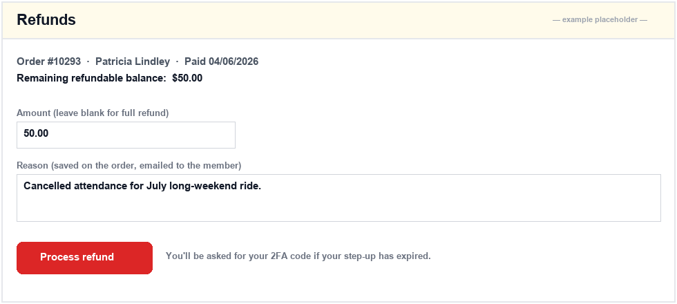
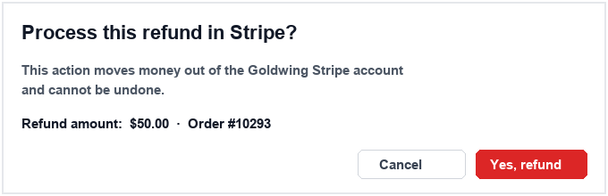

# Refunds

## What this covers

How an admin gives a customer their money back. The button lives on the order detail page; the work happens in `App\Services\RefundService::processRefund`, which calls Stripe, writes a row to `store_refunds`, updates the order, logs the action, and emails the customer. Full and partial refunds use the same path — a blank amount means "refund whatever's left".

## Why it exists

Refunds move real money out of the Goldwing Stripe account and into a member's bank, so we want one code path doing it. Wrapping it in a service lets us enforce step-up auth, check the refundable balance against past refunds (no double-refunding $50 on a $50 order), keep a local mirror in `store_refunds`, log every attempt to `activity_log`, and fire the customer email and security alert from the same place.

Members can **not** refund themselves. There is no member-portal refund button by design — every refund is admin-initiated.

## How it works

### Who can issue refunds

The permission key is `admin.payments.refund`. Per `ADMIN_GUIDE.md` and `includes/admin_permissions.php`, three roles have it by default: **Admin**, **Committee Member**, and **Treasurer**. The store-side check uses a parallel key `store_refunds_manage` (`includes/store_helpers.php`) which is admin-only.

Two entry points, same service call:

| Entry point | Check | File |
|---|---|---|
| Order detail → Refunds panel | `store_user_can($user, 'store_refunds_manage')` | `public_html/admin/store/order_view.php` (action `refund_order`) |
| Member profile → Orders → Refund | `AdminMemberAccess::canRefund($user)` | `public_html/admin/members/actions.php` (action `refund_submit`) |

### Step-up auth

Before the service is called, the page invokes `require_stepup()`:

```php
require_stepup($_SERVER['REQUEST_URI'] ?? '/admin/store/orders');
```

If the admin hasn't completed a 2FA challenge in the last few minutes, they're bounced to `/stepup.php` and returned to the refund form after re-verifying. See [Chapter 06 — 2FA, step-up & trusted devices](view.php?slug=06-2fa-stepup).

### What `processRefund` actually does

`RefundService::processRefund($orderId, $memberId, $amountCents, $reason, $adminUserId)` does:

1. `OrderRepository::getById()` — bails if missing.
2. `OrderRepository::calculateRefundableCents()` — order total minus every `store_refunds` row already `processed`. Rejects amounts ≤ 0 or > remaining.
3. Reads `stripe_payment_intent_id`. No intent = no refund (manual/free orders need a bank transfer).
4. Logs `refund.requested` to `activity_log` *before* hitting Stripe.
5. `StripeService::createRefund($intent, $amountCents)` calls `refunds->create` with the active secret key. Omitting `amount` = full refund.
6. If Stripe returns nothing, logs `refund.failed` and throws — the page surfaces the message.
7. Inserts a `store_refunds` row with `status = 'processed'` and the returned `stripe_refund_id`.
8. Updates `store_orders` — `payment_status` becomes `refunded` (full) or `partial_refund`; `order_status` flips to `cancelled` on full refunds.
9. Adds a `refund.processed` event to the order timeline.
10. Logs `refund.processed` to `activity_log`.
11. Fires `SecurityAlertService::send('refund_created', …)` to security recipients.
12. Dispatches the `store_refund_processed` notification to the customer.
13. Returns `['refund_id', 'stripe_refund_id', 'remaining_refundable_cents']`.

### Local ↔ Stripe link

Every `store_orders` row from checkout has a `stripe_payment_intent_id` — that's the only handle we need; Stripe figures out which charge to refund. The returned `stripe_refund_id` (e.g. `re_3Q4xxxxxxxx`) is the canonical receipt — searchable in the Stripe dashboard.

### What the customer sees

The `store_refund_processed` template (in `App\Services\NotificationService`) emails: "Your refund for order **#{{order_number}}** has been processed. Amount: {{refund_amount}}. Reason: {{refund_reason}}." The money lands back on the original card; Stripe quotes 5–10 business days depending on the issuing bank — we don't promise a number in the email because we can't enforce it. Email only, no SMS.

## Where to change it

- **Button / form** — `public_html/admin/store/order_view.php` (Refunds panel ~line 409) and the orders tab in `public_html/admin/members/view.php`.
- **Refund logic** — `app/Services/RefundService.php`. One file, one method.
- **Stripe call** — `app/Services/StripeService::createRefund()` (line 156). Add refund-with-reason or refund-as-fraud params here.
- **Customer email copy** — Settings → Notifications → "Store refund processed".
- **Permission keys** — `includes/admin_permissions.php` and `includes/store_helpers.php`.

## Settings

This chapter has no settings of its own beyond:

- **Notification template** — `Settings → Notifications → Store refund processed` (subject and body, with `{{order_number}}`, `{{refund_amount}}`, `{{refund_reason}}` placeholders).
- **Security alert recipients** — who gets the `refund_created` alert. Configured in the Security alerts settings; consumed by `SecurityAlertService`.
- **Stripe secret key** — `Settings → Payments → Stripe`. Refunds use whatever key `StripeSettingsService` reports as active. See [Chapter 13 — Stripe integration overview](view.php?slug=13-stripe-overview).

## Screenshots

<!-- SCREENSHOT: The Refunds panel on an order detail page at /admin/store/orders/<order_number>, showing the amount + reason fields and the red "Process refund" button. Capture on draft.goldwing.org.au logged in as admin. Save to public_html/admin/help/images/17-refund-button.png and uncomment below. -->
<!--  -->

<!-- SCREENSHOT: The browser confirm() dialog ("Process this refund in Stripe?") that fires when an admin clicks the button. Same instructions. Save as 17-refund-confirm.png. -->
<!--  -->

## Gotchas

- **No payment intent, no refund.** Orders created manually (cash, bank transfer, comp tickets) have no `stripe_payment_intent_id` and throw `"Stripe payment intent is not available for this order."` Refund off-platform and add an admin note.
- **No member, no refund.** The order-view path bails with "Refunds require a linked member account" if `member_id` is null. Guest-checkout orders need the member link patched first.
- **Stripe rejections look like generic failures.** `StripeService::createRefund()` swallows the `ApiErrorException` and returns `null`, so `RefundService` throws the generic `"Stripe refund could not be completed."` That covers already-refunded, insufficient balance, expired charge (>180 days), and rate-limit — check the Stripe dashboard's Events log for the real reason. The `refund.failed` row in `activity_log` confirms the attempt happened.
- **Rerunning a failed refund after key rotation.** Failed refunds leave the order unchanged and write no `store_refunds` row — just hit "Process refund" again with the new key in place. No cleanup needed.
- **The refundable total is computed live.** `calculateRefundableCents()` sums only `status = 'processed'` rows, so a future `requested`/`failed` status wouldn't lock funds. If you ever introduce a "pending refund" workflow, update that query.
- **`store_refunds` is created by the members module.** If a fresh DB is missing the table, the service throws `"Refunds table is missing…"` — apply `database/members_module.sql`. See [Chapter 03 — Database & migrations](view.php?slug=03-database-migrations).
- **Security alerts fire even on partial refunds.** Intentional — every refund is a money-movement event worth flagging.
- **No undo.** Once Stripe accepts the refund, there is no "cancel". Take payment again as a new order.

## Related chapters

- [06 — 2FA, step-up & trusted devices](view.php?slug=06-2fa-stepup) — what `require_stepup()` does.
- [08 — Activity & audit log](view.php?slug=08-activity-audit) — where `refund.requested`/`failed`/`processed` events land.
- [13 — Stripe integration overview](view.php?slug=13-stripe-overview) — secret key lifecycle and `StripeService` wiring.
- [15 — Orders & checkout flow](view.php?slug=15-orders-checkout) — where `stripe_payment_intent_id` comes from.
- [16 — Webhooks & idempotency](view.php?slug=16-webhooks-idempotency) — Stripe also sends `charge.refunded` webhooks; the handler is idempotent so locally-initiated refunds don't double-process.
- [22 — Notifications & email](view.php?slug=22-notifications-email) — editing the refund email template.
