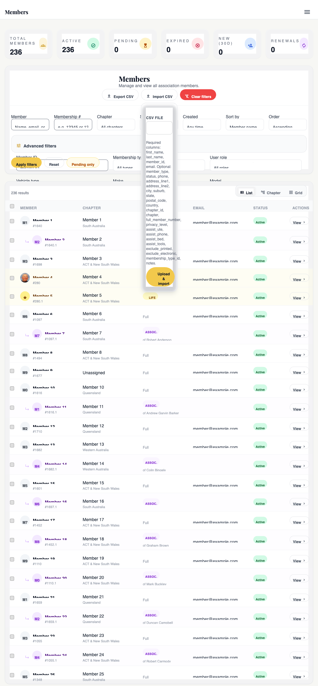

# Members admin console

## For administrators

### What this is

The **Members admin console** is the central place to look up, view, and manage member records. Every other module — store orders, refunds, chapters, the public directory — eventually points back here when you need to know *who* a person is, *what they've done*, or *fix something on their account*.

If you ever think "I need to look that member up," this is where you go.

### What you can do here

- **Search and filter** the full member list (by name, email, member number, chapter, status, membership type, role, directory preferences, vehicles, signup date, upcoming expiry).
- **View a member** — open their record and see everything we know about them.
- **Edit their profile** — name, contact details, address, date of birth, directory preferences.
- **See their orders** — every membership renewal, every storefront purchase.
- **Reset their password** — send a reset link, or set a temporary password.
- **Refund them** — issue a refund directly from their record (cross-ref [Chapter 17 — Refunds](view.php?slug=17-refunds)).
- **Manage their vehicles** — add, edit, remove bikes / trikes / sidecars / trailers.
- **See their activity** — every change that's ever been made to their account, who made it, and when.

### Who's allowed

Permissions are layered:

- **Admin** — sees and edits every member, every chapter, every action available.
- **Area Reps** — see only members in **their own chapter**. They can view and use most read-side features but most write actions are locked. (See "Area reps see only their chapter" under What can go wrong.)
- **Store Manager** — has access for store-related lookups (finding the member behind an order, looking at order history).
- **Treasurer** — has access for billing-related actions, including refunds.

If you can't see a button you expect to see, it's almost always a role issue — ask an admin to check Settings → Accounts & Roles.

### Where to find it in admin

**Admin → Members.** That's the list. From there you click any member's name to open their detail page.

You'll also land here indirectly from other places — clicking a member name on an order, a refund record, an activity-log row, or the chapter page all bring you to the same member detail view.

### The members list

The list view is the screen you land on first. Each row is one member. A stats panel at the top shows totals: **ACTIVE**, **LAPSED**, **PENDING** counts. If you're an area rep, those numbers are scoped to your chapter.

**To search**, type into the search box at the top — it matches name, email, and member number. To narrow further use the filter chips: chapter (including a **No chapter assigned** option to surface members who never got placed into one), status, membership type, role, directory preferences (the A–F flags), vehicle type, signup date range, and **Expiring** (within 30 / 60 / 90 days, before the next 31 July renewal, or already expired). The **Expired** and **Expiring (60d)** stat cards above the list are clickable shortcuts to the same filters.

When you click into a member from a filtered list, the **Member Profile** back-arrow on their detail page returns you to the exact same filtered list — so you don't have to re-apply the chapter/status/etc. each time you bounce in and out. (The filter URL is carried via a `return_to` query param on the member link.)

**Each column means:**

- **Member #** — the unique reference for this person (e.g. `M1234` or `M1234.2` for an associate).
- **Name** — full name.
- **Email** — primary email on file.
- **Chapter** — the chapter they belong to.
- **Type** — membership type (Full, Associate, Life, etc.).
- **Status** — ACTIVE / LAPSED / PENDING / CANCELLED.
- **Last login** — when they last signed in.
- **Joined** — when their record was first created.

**Inline editing** (full admins only) — chapter, status, and the 2FA flag can be changed directly from the row without opening the member.

**Bulk actions** — tick multiple rows and you can: assign chapter, change status, enable 2FA, send a password reset link, send the welcome email, archive, or delete. Delete asks you to type `CONFIRM` because it can't be undone.

### Adding a member (the wizard)

The **Add Member** button (top-right of the list, full admins only) opens a step-by-step wizard that sets up one member from scratch — details, membership, expiry, and the first email, all in one go. It's the single-member counterpart to CSV import.

The steps are:

1. **Type & number** — Full / Associate / Life, chapter, and the membership number (the next free number is suggested; override if you need to). For an **Associate**, you can link them to an existing **Full** member — they then share that member's base number and get the next free suffix automatically (e.g. `1234.2`). Leave the link blank to give the associate their own number.
2. **Contact** — first name, last name, email (all required), phone.
3. **Address** — all optional.
4. **Preferences** — Wings delivery, privacy level, and the A–F directory / assistance flags. The **Australia Post presort code (Zone)** field on the member view (Preferences & Assistance card) is admin-only — never shown to members — and records the postal sort zone used when mailing printed Wings copies (`members.australia_presort_code`).
5. **Bikes** — optionally add one or more Goldwings (make / model / year / rego / colour). Empty rows are ignored.
6. **Membership & expiry** — pick the membership plan and status (**Active (paid)**, **Pending payment**, **Complimentary**, or **Lapsed**), the start date, and the renewal/expiry date. The expiry auto-fills using the **31 July** anchor (roll to next year if joining in August or later) and stays editable. Amount paid prefills from the plan price **plus the one-off Joining fee** (the default comes from Settings → Membership Settings, currently $15 — set it to 0 for associates or renewals). The amount is fully editable: once you type your own figure the auto-fill stops overriding it. This creates the membership period **and** a matching manual order — exactly like the "Manual membership order" tool on the Orders tab.
7. **Finish** — the member and membership are always created; the checkboxes choose what to send:
   - **Send welcome email** — creates a login and emails a "set your password" link. (Needs the same permission as a password reset.)
   - **Send payment email** — emails a payment link. Only actually sends when the membership status is **Pending payment**.
   - **Set up renewal reminders** — uses the renewal date so the nightly cron auto-sends reminders 60 & 30 days before expiry. (No extra step is needed beyond having an expiry date.)

On submit you land on the new member's Overview with a confirmation of what was created and which emails went out.

### A member's detail page

Click a member's name to open their detail page. It's a tabbed view. Here's what's on each tab.

#### Overview

The snapshot. At a glance: contact details, chapter, current membership period, recent orders, recent activity, and the danger-zone buttons (archive, delete, force password reset). If you only need to glance at someone, this tab tells you nearly everything.

#### Profile

The editable identity record — name, email, phone, address, date of birth, directory preferences.

**Editable** by anyone with profile-edit permission. The member number itself is generally **locked** (it's their permanent reference). Some fields may also be locked depending on role — area reps see the profile but typically can't change it.

Changes save to the member's record and write to the activity log so you can see what changed and when.

#### Vehicles

Their bikes, trikes, sidecars, and trailers. Add a new bike, edit an existing one, delete one, mark a bike as their **primary** vehicle. Each vehicle stores make / model / year / colour / rego.

This tab matters for ride days, insurance, and the public directory — having the bike details accurate makes the rest of the site work properly for them.

#### Orders

Every purchase the member has ever made — membership renewals and storefront orders. From here you can:

- Click any order to open it in full.
- Manually fix a stuck order (e.g. payment came in by bank transfer and the order needs to be marked paid).
- Resync an order against Stripe (re-fetch the payment status — useful if you suspect a webhook missed).
- For pending memberships: accept, reject, or resend the payment link.
- **Void** an order — soft-delete, hides it from default lists, still shows here struck-through with a "Voided" badge. Reversible via the "Restore" button.
- **Delete** an order permanently — removes the order + its items, events, refunds, and shipments. A typed `DELETE` confirmation is required. Stripe-side payments are NOT cancelled; refund first if money actually moved.

#### Refunds

Refund history for this member — every refund ever issued against any of their orders. You can also start a new refund from here.

The refund itself goes through the same engine as everywhere else. See [Chapter 17 — Refunds](view.php?slug=17-refunds) for the full walkthrough.

#### Activity

Every action ever taken on this member, in time order, with who did it. Profile edits, password resets, status changes, vehicle additions, refunds, impersonation sessions — all of it.

This is the audit trail for that one person. If you ever need to answer "who changed X on this account and when," this tab tells you.

### Common tasks

{{tour:admin-find-edit-member}}
{{tour:admin-make-life-member}}

- **Add a new member from scratch** — Members list → **Add Member** (top right) → walk the wizard. See "Adding a member (the wizard)" above.
- **Reset a password** — open the member → Settings tab (or Overview) → **Send reset link**. They get an email. If you need to bypass that — e.g. they've lost access to their email — use **Set password** to give them a temporary one and tell them in person.
- **Make someone a Life Member** — open the member → Orders tab → scroll to **Manual membership order** → set type to **Life**, cost as appropriate, save. The walkthrough above will take you through it.
- **Update contact details** — Profile tab → edit the fields → Save. The activity log records what changed.
- **Refund a member** — Refunds tab → fill in amount and reason → Process refund. (See [Chapter 17](view.php?slug=17-refunds).)
- **Add a vehicle** — Vehicles tab → Add → fill in make / model / year / colour / rego.
- **Change a member's chapter** — Profile tab (or inline on the list row, full admins only) → pick the new chapter → Save.
- **Manually issue the welcome email** — useful if a member never received the original. Find them in the list → tick the row → Bulk actions → Send welcome email. Or from their detail page if there's a Send welcome button on Overview.

### "Become this member" — impersonation

There's a button on the member detail page that says **Become this member** (sometimes labelled "Impersonate"). Clicking it logs you into the member portal *as them* — you see exactly what they see.

**What it does** — gives you a read-only-ish view of their member portal. Useful when a member says "I can't see X" and you want to confirm what they're looking at.

**Why it logs** — every impersonation session is recorded in their activity log (`impersonation.started` and `impersonation.stopped`). You can never quietly become someone else.

**What the member sees** — nothing in real-time, but if they look at their own activity log later they'll see the impersonation rows. We're transparent about it.

**Two important caveats:**

- Impersonation does **not** give you their 2FA codes. If the member portal asks for a step-up challenge while you're impersonating, you'll be stuck — because you don't have their phone. Use impersonation for "see what they see" only; for actual fixes, work from the admin side.
- A sticky banner shows at the top of the member portal while you're impersonating ("You are signed in as X — return to admin"). Click that banner to stop impersonating.

### Bulk tools

These live under Admin → Members and are used occasionally, not daily.

- **Export** — download a CSV of members matching your current filters. Requires a 2FA step-up because it's pulling personal data. Every export is logged and admins get an email about it. Don't export more than you need.
- **Import** — upload a CSV to bulk-create or bulk-update members. Requires step-up. Used for migrations and bulk onboarding.
- **Suburb merge** — a one-off cleanup tool that fills in missing suburb data from the original import file. It only fills empty fields; it never overwrites existing data.
- **Baseline backfill** — another one-off cleanup tool that creates login accounts for members who don't have one and promotes PENDING records to ACTIVE where appropriate. It's a starting-line tool — once a site is established, you won't run it.

The suburb merge and baseline backfill exist because of the original data migration. They're not for everyday use.

### What can go wrong

- **Duplicate members.** Two records for the same person — often happens when someone signs up via the storefront and later joins as a member, or when an old import created an extra. Pick the record you want to keep, copy the orders / activity across by hand if needed, then archive (don't delete) the duplicate so the audit trail stays.
- **A member who should be there is missing.** Three usual causes: (1) you're an area rep and they're in a different chapter; (2) their status is ARCHIVED — archived members are hidden from the default *browse* list, but since July 2026 an explicit **search** (name, email, or member number) finds them regardless, so search first; (3) the search is matching too strictly — try just their member number or just their email.
- **Profile changes are not saving.** Usually a permission problem — area reps can see the Profile tab but not save it. If you're an admin and saves still fail silently, an underlying database column may be missing — flag it to your developer. The activity log will confirm whether the save ever even ran.
- **You can't see a member you know exists.** Area reps: confirm the member's chapter — `AdminMemberAccess` scopes you to your own chapter only. If you're seeing nothing at all and you're an area rep, your own member record might be missing a chapter — ask an admin to fix yours.

### What gets recorded

Everything sensitive lands in the activity log. That includes: profile edits, password resets, password sets, archives, deletes, status changes, vehicle adds / edits / deletes, 2FA changes, refunds, order updates, manual fixes, impersonation start / stop, and CSV exports.

You'll see verbs like `member.profile_updated`, `member.password_reset_link_sent`, `member.archived`, `order.refunded`, `impersonation.started`. They all show up in **Admin → Security Log**, filterable by member or by admin. See [Chapter 08 — Activity & audit log](view.php?slug=08-activity-audit).

If you ever need to answer "who did what on this account," it's all there.

### Good practice

- **Always type a reason for sensitive changes.** Refunds, password sets, status changes — even when the field is optional, fill it in. Future-you (or the next membership secretary) will thank you.
- **Don't impersonate without need.** It's logged, the member can see it. Reserve it for "I want to see what they're seeing." For everything else, work from the admin side.
- **Export only the data you need.** Filter the list down to the rows you actually want before clicking Export. A 5,000-row CSV of every member's contact details sitting in your Downloads folder is a data risk; a 12-row CSV of one chapter's roster isn't.
- **Archive instead of delete.** Delete is permanent and loses the audit trail. Archive keeps everything; you can always un-archive later.
- **Don't edit a member when you can ask them to.** If a member can update their own profile through the member portal, that's the better path — the record then reflects *their* version of truth, not ours.

### Who to ask if stuck

- **Permission problem** — site admin, who can change roles in Settings → Accounts & Roles.
- **Can't find a member** — check with another admin who can see all chapters; if it's an archived record, switch the status filter.
- **A field looks wrong but won't save** — flag it to your developer with the member number and which field. The activity log slice for that member will help them trace it.
- **Suspected duplicate** — bring it to a senior admin before merging or deleting; the consequences of a wrong merge are hard to undo.

---

<strong>Dev notes</strong>

### What this covers

Everything under `/admin/members/`: the list view, the per-member detail view (Overview / Profile / Vehicles / Orders / Refunds / Activity), the CSV export, the bulk importers, the one-off cleanup tools, the central `actions.php` dispatcher, and the three services behind it — `AdminMemberAccess`, `MemberRepository`, `VehicleRepository`. This chapter is about *operating* on members. The lifecycle (PENDING → ACTIVE → LAPSED → CANCELLED) and renewals live in [Chapter 19](view.php?slug=19-membership-lifecycle).

### Why it exists

A single pane of glass. Every operation an admin or area rep performs on another person's account — orders, refunds, password reset, fix a stuck membership, archive, add a bike — has to live somewhere obvious, be auditable, and be permission-checked at three altitudes:

- **HTTP entry** — `require_permission('admin.members.view')` gates the page itself.
- **Action handler** — `actions.php` re-checks the specific verb (`canRefund`, `canImpersonate`, etc).
- **Data layer** — `MemberRepository::search` filters by `chapter_id` when the caller is an area rep.

That layering is why `AdminMemberAccess` exists as its own service — every page asks the same questions and we don't want each to re-derive the answer.

### How it works

#### List view — `/admin/members/index.php`

Reads filters from the query string (`q`, `status`, `chapter_id` (with the sentinel `0` meaning *no chapter assigned* → `m.chapter_id IS NULL`), `membership_type_id`, `role`, `directory_pref[]`, `vehicle_*`, `created_range`, `expiring_within` (`30d` / `60d` / `90d` / `eoy` = before next 31 July / `expired`), `sort_by`, `sort_dir`, paging), hands them to `MemberRepository::search`, renders a table. The `expiring_within` filter compares the member's **latest** ACTIVE `end_date` (a `MAX(end_date)` subquery against `membership_periods`) to the chosen window — not just *any* active period, because after a renewal the old period stays ACTIVE until the expiry cron flips it, and matching it listed already-renewed members as "expiring" (July 2026 report). A stats panel shows ACTIVE / LAPSED / PENDING / **EXPIRING (60d)** counts (scoped to the chapter filter for area reps); the EXPIRED and EXPIRING cards are anchor tags that link back to the same filter for one-click drill-down. Power features:

- **Inline editing** — full-access admins edit chapter, status, and 2FA flag from the row, POSTing `action=member_inline_update`. Area reps cannot inline-edit.
- **Bulk actions** — multi-select rows then run `assign_chapter`, `change_status`, `enable_2fa`, `send_reset_link`, `send_welcome_email`, `archive`, or `delete` (delete requires typing `CONFIRM`). Dispatched as `bulk_member_action` → JSON.
- **Directory preferences** — A–F flags every member sets on their public directory entry. Admins filter and see them regardless of the member's opt-in.

#### Member detail — `/admin/members/view.php?id=X`

Tabbed view, tab in `?tab=`:

| Tab | What lives there |
|---|---|
| `overview` | Snapshot, contact, chapter, current membership period, recent orders, recent activity, danger-zone actions |
| `profile` | Editable identity record — name, email, phone, address, DOB, directory prefs. Gated by `canEditProfile`. Saves to `save_profile`. |
| `roles` | Role assignment (admin / treasurer / area_rep / member). Posts `roles_update`. Cross-ref [Chapter 07](view.php?slug=07-roles-permissions). |
| `settings` | Notification prefs, 2FA toggle / force / exempt / reset, avatar, member number rename. |
| `vehicles` | Bikes, trikes, sidecars, trailers (`VehicleRepository`). Posts `bike_add` / `bike_update` / `bike_delete`. |
| `orders` | Membership orders + storefront orders. Manual fix (`manual_order_fix`), Stripe resync (`order_resync`), accept/reject/send-link for pending memberships. |
| `refunds` | History plus the refund initiation form. Posts `refund_submit` → `RefundService`. Cross-ref [Chapter 17](view.php?slug=17-refunds). |
| `activity` | Per-member activity log slice. Cross-ref [Chapter 08](view.php?slug=08-activity-audit). |

Edit controls render conditionally on the relevant `AdminMemberAccess::can*` check. Area reps see all tabs but read-only on most.

#### Actions dispatcher — `/admin/members/actions.php`

One large file with a giant `switch ($action)` handling every state-changing operation. Monolithic on purpose: every action shares the same prologue — parse `$_POST`, verify CSRF, load the member, check `AdminMemberAccess`, optionally `require_stepup()`, log to `activity_log`, redirect with flash. Splitting into 40 endpoints would multiply boilerplate and audit surface. Cases include `save_profile`, `change_status`, `member_archive`, `member_delete`, `send_reset_link`, `set_password`, `refund_submit`, `manual_order_fix`, `order_resync`, `twofa_force` / `_exempt` / `_reset`, `bike_*`, `manual_membership_order`, `create_member`, `impersonate_member`, and ~30 more.

A `$sensitiveActions` array at the top lists every verb that triggers `require_stepup()` — basically anything that mutates state. Most actions also assume a loaded member (`$requiresMemberContext`); the exceptions that run before a member exists are `member_inline_update`, `bulk_member_action`, and `create_member`.

Three reusable helpers near the top of the file back both the per-member actions and the add-member wizard, so the two paths can't drift:

- `insertMemberBike($pdo, $memberId, $data)` — column-detected bike INSERT (used by `bike_add` and the wizard's bike step).
- `sendWelcomeEmailForMember($pdo, $member, $actor)` — ensures a login exists and emails the set-password link; returns `['success', 'error', 'user_id']` instead of redirecting (used by `send_welcome_email` and the wizard).
- `createMembershipForMember($pdo, $memberId, $params, $actor, $forceMemberTypeCode = null)` — creates the membership period + manual order and returns the result; does **not** send emails (callers do). Used by `manual_membership_order` and the wizard. `$forceMemberTypeCode` lets the wizard keep the admin-chosen FULL/ASSOCIATE/LIFE instead of deriving it from the plan name.

#### Add-member wizard — `/admin/members/add.php` + `create_member`

`add.php` is a single page with seven client-side steps (vanilla JS, one final POST) — gated on `isFullAccess` **and** `canManualOrderFix`, and blocked for chapter-restricted accounts. It posts `action=create_member`, which:

1. Validates name/email (`MemberRepository::isEmailAvailable`).
2. Resolves the member number — Full/Life/unlinked-associate get their own base (suggested = `MAX(member_number_base)+1` honouring `membership.member_number_start`, overridable); a linked associate reuses the parent's base + `MAX(suffix)+1`. Duplicates are rejected.
3. Minimal `INSERT` of the required columns, then `MemberRepository::update()` for all the optional profile fields (address, suburb→city, directory prefs, etc.) so the field mapping isn't duplicated.
4. Optional bikes via `insertMemberBike`.
5. Membership + order via `createMembershipForMember` (always created).
6. Emails per the `finish_actions[]` checkboxes — `welcome` (→ `sendWelcomeEmailForMember`, needs `canResetPassword`) and `payment` (→ `membership_order_created`, only when status is pending). `renewal` is a no-op beyond having an expiry date the renewal-reminder cron picks up.
7. Logs `member.created` and redirects to the new member's Overview.

The JS mirrors `MembershipService::calculateExpiry` (31 July anchor) to auto-fill the renewal date, prefills cost from the plan's `price_cents`, and filters the full-member link list client-side.

#### Impersonation — "Become this member"

`impersonate_member` writes `$_SESSION['impersonation']` with the admin's original user id + target user id, logs `impersonation.started`, and redirects to the member portal. `bootstrap.php` exposes `impersonation_context()` / `is_impersonating()`; partials use those to render a sticky banner in the member area ("You are signed in as X — return to admin"). A "stop impersonating" link clears the key.

#### Export — `/admin/members/export.php`

CSV download. Requires `admin.members.view` **and** `require_stepup()` (July 2026: was `admin.members.import_export`, but the export is read-only — the email PDF list and printed mailing list are committee essentials, so anyone who can see the members list can export it; the destructive import/backfill/merge tools stay behind `import_export`). Columns: `Member #, Name, Email, Phone, Address 1, Address 2, Suburb, State, Postcode, Country, Chapter, Membership Type, Status, Last Login, Created, Directory Preferences`. Logs `member.export` with the row count and fires `SecurityAlertService::send('member_export', ...)` so admins get an email every time. Honours the same filters as the list view, including area-rep chapter scoping. The **Wings magazine** filter and the **Printed mailing list** button pass `wings_preference=printed`, a convenience value resolved in `MemberRepository` to `wings_preference IN ('print','both')` — i.e. everyone who needs a physical copy posted. Everyone receives the email PDF regardless, so there is no "print only" category any more. The **Email PDF list** button passes `list=email_pdf`: this is the electronic Wings distribution list, so it deliberately **ignores** the `wings_preference` filter *and* the directory opt-outs (the directory-F "exclude electronic directory" flag is about the online member directory, not magazine delivery) and returns every current member who has an email address. Members with no email are skipped. Don't confuse the **Email-only (no posted copy)** Wings filter — that's the subset who *opted out of a printed copy*, not the list of who gets emailed.

#### Import — `/admin/members/import.php` and `import_from_datafile.php`

Both require `admin.members.import_export` + step-up. `import.php` takes a CSV upload from the admin UI. `import_from_datafile.php` is a one-shot endpoint that reads `scripts/data/import_main_life.csv` or `import_associates.csv` directly from disk — the file header literally says "DELETE THIS FILE once the import is complete." Both share the column-mapping helpers (`normalizeHeader`, `parseCsvBoolean`, `fetchMemberColumns`) and go through `MemberRepository`.

#### Cleanup utilities

- **`merge_suburbs.php`** — backfills `members.suburb` from the import CSVs *only where empty*, matching on `member_number_base.suffix`. Dry-run by default; POST `mode=apply` to commit. Never overwrites.
- **`backfill_member_baseline.php`** — promotes PENDING → ACTIVE, links members to existing `users` by email (creates one with a random password if none exists), assigns the `member` role where missing. The "baseline" gives every member a working login + an audit baseline so future profile edits diff against something. Dry-run by default; POST `apply=1` to commit.

#### `MemberRepository` and `VehicleRepository`

`MemberRepository` is the read/write surface for `members`, `membership_periods`, `user_roles`, and member-auth rows. Public surface: `search`, `findById`, `findByEmail`, `updateProfile`, `directoryPreferences()` (the canonical A–F map), plus helpers that gracefully degrade when an optional column is missing — it inspects `information_schema` on first call and caches per request. `VehicleRepository` does the same for `member_vehicles` (`listByMember`, `getById`, `create`, `update`, `delete`, `setPrimary`) with `ALLOWED_TYPES = ['bike', 'trike', 'sidecar', 'trailer']`.

#### Activity logging — every sensitive action

Every state-changing case ends with `ActivityLogger::log(...)`. Verbs you'll see: `member.profile_updated`, `member.password_reset_link_sent`, `member.password_set`, `member.archived`, `member.deleted`, `member.status_changed`, `member.vehicle_*`, `member.twofa_*`, `order.refunded`, `order.updated`, `impersonation.started` / `_stopped`, `member.export`. Schema and viewer in [Chapter 08](view.php?slug=08-activity-audit).

### Where to change it

- New column on the list view → `MemberRepository::search` (SELECT + table render in `index.php`).
- New tab on the detail view → add to `$tabOptions` + `$tabIcons` in `view.php` and render the panel block.
- New state-changing verb → add a `case` in `actions.php` and append to `$sensitiveActions` if it mutates anything. Don't forget the `ActivityLogger::log` line.
- New per-action permission → add a `can*` method to `AdminMemberAccess` and check it both in the page render and in the action handler.

### Settings

No global settings are unique to this chapter. The directory-preference visibility flags (A–F) live per-member on the `members` row itself, not in `settings_global`.

### Gotchas

- **Area reps see ONLY their chapter.** `AdminMemberAccess::getChapterRestrictionId($user)` returns the rep's own `members.chapter_id` and `index.php` / `export.php` force-set `$filters['chapter_id']` to it. If a rep's own chapter id is null, they see nothing — fix the rep's record, not the access logic.
- **Impersonation does NOT bypass 2FA on the impersonated account.** It writes a session key, not auth credentials. If the impersonated account triggers a step-up challenge you'll be prompted as them — and you won't have their TOTP. Use it for read-only "see what they see" cases; for actual fixes, edit on the admin side.
- **Export is sensitive — step-up required.** Same for both importers. Don't try to script around this from the browser.
- **`actions.php` is a monolith — long file.** ~2,300 lines, one switch. Resist splitting without first factoring out the shared prologue (CSRF + load member + access check + step-up + log + flash). Half-refactoring would scatter the audit story.
- **Directory preference visibility is asymmetric on purpose.** Admins always see A–F flags regardless of opt-in; public directory and member self-service obey the flags. Don't add an admin-side toggle that "hides" them — admins need the full picture.
- **`import_from_datafile.php`, `merge_suburbs.php`, `backfill_member_baseline.php` are one-shot migration tools.** Their headers say "DELETE THIS FILE once done." They exist for traceability of the original data load; they should not be live on a long-running install.
- **Schema-aware fallbacks.** Both repositories use `SHOW COLUMNS` / `SHOW TABLES` and cache per request. That lets code survive on environments where an optional column hasn't been migrated — but a typo in a column name silently makes the feature vanish instead of erroring. Check `information_schema` if a field appears to "not save."

<!-- SCREENSHOT: List view at /admin/members/index.php with filters expanded. Capture on goldwing.org.au as a full admin. Save to public_html/admin/help/images/20-members-list.png and uncomment. -->
<!--  -->

<!-- SCREENSHOT: A member detail page at /admin/members/view.php?id=… with the tab bar visible. Save as 20-member-detail-tabs.png. -->
<!--  -->

<!-- SCREENSHOT: The export step-up prompt before /admin/members/export.php runs. Save as 20-export-stepup.png. -->
<!--  -->

<!-- SCREENSHOT: The impersonation banner visible in the member portal after clicking "Become this member". Save as 20-impersonation-banner.png. -->
<!--  -->

## Related chapters

- [06 — 2FA, step-up & trusted devices](view.php?slug=06-2fa-stepup) — what `require_stepup()` does and how the export / import prompts get triggered.
- [07 — Roles & permissions](view.php?slug=07-roles-permissions) — the `admin.members.*` capabilities `AdminMemberAccess` delegates to.
- [08 — Activity & audit log](view.php?slug=08-activity-audit) — every action this console takes ends up there.
- [17 — Refunds](view.php?slug=17-refunds) — the refund flow that the Refunds tab triggers.
- [19 — Membership lifecycle](view.php?slug=19-membership-lifecycle) — what a "member" actually is and how status transitions happen.
- [21 — Chapters & area reps](view.php?slug=21-chapters-area-reps) — the chapter model that scopes area-rep visibility.
