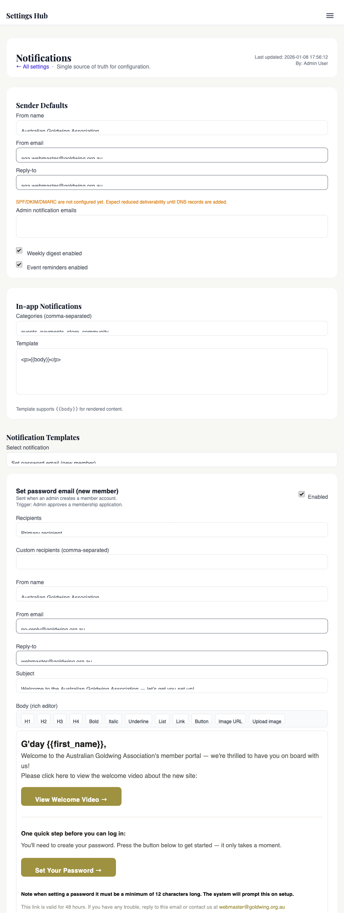

# Notifications & email

## What this covers

Every email the site sends — welcome, renewal reminder, order confirmation, refund, password reset, login OTP, admin alert — flows through the same three-layer stack: `NotificationService` (the "tell user X about Y" catalogue), `EmailService` (compose, brand-wrap, log), and a transport (PHP `mail()`, SMTP via `SmtpMailer`, or Resend.com). This chapter also covers per-user opt-outs, unsubscribe tokens, the in-app Notification Hub at `/admin/requests/`, and the (stubbed) SMS path.

## Why it exists

- **Member contact at scale, editable without a deploy.** Subjects, bodies, sender names and per-template recipient modes live in `settings_global` → `notifications.catalog`. The webmaster can rewrite the renewal-reminder copy in the admin UI; no PR required. Default copy ships in `NotificationService::definitions()` so a wiped row falls back to sensible text.
- **Admin alerting that's separate from member email.** Security events (FIM changes, repeated failed logins, refunds) shouldn't share a recipient list or an opt-out switch with marketing. They go through `SecurityAlertService` to a dedicated alert email, gated by `alerts.*` flags in `security_settings` — see [Chapter 11 — File integrity monitoring](view.php?slug=11-file-integrity).

## How it works

### The three layers

```
caller
  │  NotificationService::dispatch('membership_approved', $context)
  ▼
NotificationService    ← catalogue lookup, recipient mode, opt-out check, {{token}} substitution
  │  EmailService::send($to, $subject, $body, $metadata)
  ▼
EmailService           ← brand-wrap, preferences/unsubscribe footer, log to email_log + ActivityLogger
  │  transport per integrations.email_provider
  ▼
SmtpMailer  |  Resend API  |  PHP mail()
```

**`NotificationService::dispatch($key, $context, $options)`** looks the key up in `getCatalogSettings()` (defaults merged with DB overrides), bails if the per-template `enabled` flag or the global kill-switch `notifications.enabled` is off (unless `options.force = true`), resolves recipients from `recipient_mode` (`primary` / `admin` / `both` / `custom`), runs `NotificationPreferenceService::shouldReceive()` for non-mandatory templates, substitutes `{{tokens}}`, and calls `EmailService::send()` once per recipient.

**`EmailService::send($to, $subject, $body, $metadata)`** is the lower-level "just send this email" call — also used directly by `InvoiceService`, `SecurityAlertService`, `cron/send_renewal_reminders.php`, and admin tools. It wraps the body in the gold-branded HTML shell (`wrapHtml()`) unless it already carries `data-email-template="goldwing"`, appends a tokenised preferences/unsubscribe footer (skipped for mandatory templates), picks the transport from `integrations.email_provider` (`php_mail` default / `smtp` / `resend`), and logs the attempt to `email_log` plus an `email.sent` ActivityLogger event with the full subject + body snapshot for replay.

**`SmtpMailer`** is a hand-rolled SMTP client (`fsockopen` + EHLO/STARTTLS/AUTH LOGIN/DATA). It reads `integrations.smtp_*`, supports `tls`/`ssl`/none, wraps long lines at 990 bytes and escapes leading dots — the basics PHPMailer would otherwise handle. **Resend.com** is the alternative HTTP transport: set `integrations.email_provider = 'resend'` and `integrations.resend_api_key` and `EmailService` POSTs to `https://api.resend.com/emails` instead. Useful when shared-host SMTP is flaky.

### Templates and the {{token}} system

There's no separate template directory. Each notification's HTML body lives inline in `NotificationService::definitions()` as `defaults.body`. The webmaster overrides `subject`, `body`, `from_name`, `from_email`, `reply_to`, `recipient_mode`, `custom_recipients`, and `enabled` per-template via Admin → Settings → Notifications → Catalogue. Overrides land in `notifications.catalog` as a JSON map keyed by template ID.

Token substitution is intentionally naive — `{{member_name}}`, `{{order_number}}`, `{{reset_link}}` etc. are replaced by a `strtr()` over the context array. No conditional logic, no loops; for lists (items, tickets), the caller pre-renders the HTML and passes it as one token (`{{items_html}}`, `{{ticket_list_html}}`). Each definition declares its supported `placeholders` so the settings UI can show them.

### What gets sent, and when

| Template key | Trigger | Mandatory? |
|---|---|---|
| `member_set_password` | Admin approves application | yes |
| `member_password_reset_self` / `_admin` | Member or admin requests reset | yes |
| `security_email_otp` | Login requires email OTP (Ch 06) | yes |
| `membership_approved`, `membership_order_created`, `membership_payment_received` | Approval / order / Stripe webhook | yes |
| `membership_order_approved/rejected`, `membership_payment_failed` | Admin action / Stripe failure | no |
| `membership_admin_pending_approval` | Bank-transfer order needs review | no |
| `store_order_confirmation`, `store_ticket_codes`, `store_shipping_update` | Store checkout / tracking saved | mixed |
| `store_refund_processed` | `RefundService` issues a refund (Ch 17) | no |
| `store_admin_new_order` | New paid store order (admin only) | no |
| `request_approved/denied/feedback`, `webmaster_new_request` | Notification Hub actions | no |

Renewal reminders are sent by `cron/send_renewal_reminders.php`, which calls `EmailService::send()` directly and additionally fires `SmsService::send()` for members with a phone number — see [Chapter 19 — Membership lifecycle](view.php?slug=19-membership-lifecycle).

Security alerts (FIM changes, repeated failed logins, new admin device, refund created, member import/export, Stripe webhook failures) bypass the catalogue and go through `SecurityAlertService::send($type, $subject, $body)` — internal-only and gated by `alerts.$type` in `security_settings`.

### OTP, unsubscribe tokens, per-user opt-outs

- **`EmailOtpService::issueCode()`** generates a 6-digit code, stores its `password_hash`, and dispatches `security_email_otp` with `force = true` (so opt-outs and the master switch can't block it). 10-minute expiry, max 5 attempts, 60-second resend cooldown, 5 resends/hour. See [Chapter 06 — 2FA, step-up & trusted devices](view.php?slug=06-2fa-stepup).
- **`EmailPreferencesTokenService::createToken($memberId, 'preferences' | 'unsubscribe')`** mints a `CryptoService::encrypt()`-wrapped token (member ID, purpose, 7-day expiry). Every non-mandatory email gets a footer with tokenised "Update email preferences" and "Unsubscribe from all non-essential emails" links, so members can opt out without logging in. Landing page is `/email_preferences.php`.
- **`NotificationPreferenceService`** stores per-user opt-outs in `settings_user.notification_preferences`: a `master_enabled` switch, an `unsubscribe_all_non_essential` flag, and per-category booleans (`calendar`, `noticeboard`, `orders`, `payments`, `admin`, `security`). Mandatory templates short-circuit the check — you can't opt out of password reset.

### SMS and the Admin Notification Hub

`SmsService::send($to, $message)` exists but **does not actually deliver SMS** — it inserts into `sms_log` and returns `true`. Wired into admin approval flows (`/admin/index.php`) and `cron/send_renewal_reminders.php`. To turn it on, swap the body for a Twilio / MessageBird HTTP call reading credentials from `integrations.*`.

`/admin/requests/` (`PendingRequestsService`) is the in-app inbox for items needing a webmaster decision: noticeboard submissions, event proposals, Fallen Wings tributes, nominations. It is **not** an email queue — emails are dispatched separately via the `webmaster_new_request` / `request_approved` / `request_denied` / `request_feedback` templates from `/admin/requests/actions.php` when the admin clicks the action.

## Where to change it

- **Email copy, subject, sender, recipients, on/off:** Admin → Settings → **Notifications** tab → Catalogue. Each row has a preview + a "Send test" button.
- **Default sender, admin recipients, master kill-switch:** top of the Notifications tab (writes to `notifications.from_*`, `notifications.admin_emails`, `notifications.enabled`).
- **SMTP host / port / user / password / encryption / Resend API key:** Admin → Settings → **Integrations** → Email card. The password input is write-only and shows "Configured - leave blank to keep" once set.
- **Member-facing opt-outs:** Member → Settings → Notifications, or any unsubscribe link in an email footer.
- **Admin security-alert recipient + which alert types fire:** Admin → Settings → Security → Alerting (`security_settings.alert_email`, `alerts.*`).

## Settings

| Key | Default | Notes |
|---|---|---|
| `notifications.enabled` | `true` | Master kill-switch — when `false`, only `force = true` calls send. |
| `notifications.from_name` | `Australian Goldwing Association` | Default From-name. |
| `notifications.from_email` | `no-reply@goldwing.org.au` | Default From-email. Validated against `*@goldwing.org.au`. |
| `notifications.reply_to` | `webmaster@goldwing.org.au` | Default Reply-To. |
| `notifications.admin_emails` | `''` | Comma/newline list used when `recipient_mode = admin` or `both`. Falls back to `site.contact_email`. |
| `notifications.catalog` | (from `defaultCatalog()`) | Per-template overrides keyed by template ID. |
| `notifications.default_categories` | all `true` | Default per-category preferences for new members. |
| `integrations.email_provider` | `php_mail` | `php_mail`, `smtp`, or `resend`. |
| `integrations.smtp_host` / `_port` / `_user` | empty / `587` / empty | Standard SMTP triple. |
| `integrations.smtp_password` | empty | **Encrypted at rest** via `CryptoService` (see Ch 10). |
| `integrations.smtp_encryption` | `tls` | `tls`, `ssl`, or empty. |
| `integrations.resend_api_key` | empty | Bearer token for `https://api.resend.com/emails`. |
| `alerts.*` (in `security_settings`) | mostly `true` | `webhook_failure`, `role_escalation`, `failed_login`, `new_admin_device`, `refund_created`, `member_import`, `member_export`, `fim_changes`. |


<!-- SCREENSHOT: Admin → Settings → Notifications tab, showing the sender block at the top and the template catalogue list below. Save as 22-notifications-tab.png. -->
<!--  -->

<!-- SCREENSHOT: Admin → Settings → Integrations tab, focused on the Email / SMTP card with the "Configured - leave blank to keep" password placeholder visible. Save as 22-integrations-smtp.png. -->
<!--  -->

<!-- SCREENSHOT: A rendered renewal-reminder email viewed in a real inbox (or the test-send preview), showing the gold header, body, and the preferences/unsubscribe footer. Save as 22-renewal-email.png. -->
<!--  -->

<!-- SCREENSHOT: The admin Notification Hub at /admin/requests/?status=pending with a few pending submissions visible. Save as 22-notification-hub.png. -->
<!--  -->

## Gotchas

- **`integrations.smtp_password` is encrypted at rest** via `CryptoService` (`['encrypt' => true]` on `setGlobal`). Decryption needs `APP_KEY` in `.env`. If `APP_KEY` is rotated or missing, the password becomes garbage and SMTP auth fails silently — see [Chapter 10 — Encryption & secrets at rest](view.php?slug=10-encryption-secrets).
- **Per-user opt-outs do NOT suppress transactional emails.** Mandatory templates (password reset, OTP, membership approval/order/payment, store order confirmation) bypass `NotificationPreferenceService` entirely and omit the unsubscribe footer — they're account-essential, like a bank statement.
- **If SMTP fails, the email is dropped silently.** `EmailService::send()` returns `false` and logs `email.smtp_failed` to ActivityLogger; almost no caller checks the return. **Admin alerts that depend on the same SMTP will also fail** — if `SecurityAlertService` is the alarm and SMTP is broken, the alarm itself never rings. Use the FIM cron log or `email_log.sent = 0` queries to spot a transport outage.
- **`from_email` is validated against `goldwing.org.au`.** `EmailService::normalizeSenderEmail()` rejects anything that isn't `*@goldwing.org.au` and falls back to the default — deliberate anti-spoof guard so a hijacked admin can't change the From to a third-party domain.
- **Preference tokens are encrypted, not signed.** `EmailPreferencesTokenService` puts a `CryptoService`-encrypted blob in the URL with a 7-day `expires_at`. No server-side revocation list; rotating `APP_KEY` invalidates every outstanding token at once.
- **`SmsService` is a stub.** It logs to `sms_log` and returns `true`. Flows that "send SMS" aren't actually sending anything yet — useful to know if a member complains they didn't get the renewal SMS.

## Related chapters

- [06 — 2FA, step-up & trusted devices](view.php?slug=06-2fa-stepup) — how `EmailOtpService` plugs into the login flow.
- [10 — Encryption & secrets at rest](view.php?slug=10-encryption-secrets) — `APP_KEY`, `CryptoService`, why losing the key breaks SMTP + unsubscribe tokens.
- [11 — File integrity monitoring](view.php?slug=11-file-integrity) — `SecurityAlertService` and the `alerts.fim_changes` gate.
- [12 — Login rate limiting & lockout](view.php?slug=12-rate-limit-lockout) — fires `failed_login` security alerts via the same path.
- [17 — Refunds](view.php?slug=17-refunds) — `store_refund_processed` to the customer and `refund_created` security alert to admins.
- [19 — Membership lifecycle](view.php?slug=19-membership-lifecycle) — which lifecycle events trigger which catalogue templates.
- [31 — Settings architecture](view.php?slug=31-settings-architecture) — how `notifications.*` and `integrations.*` are stored, encrypted, and audited.
