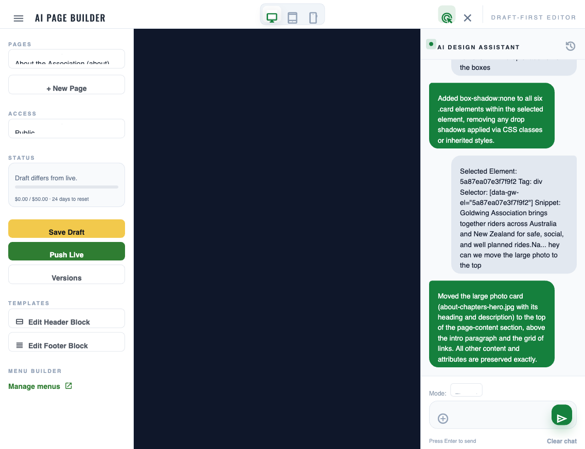
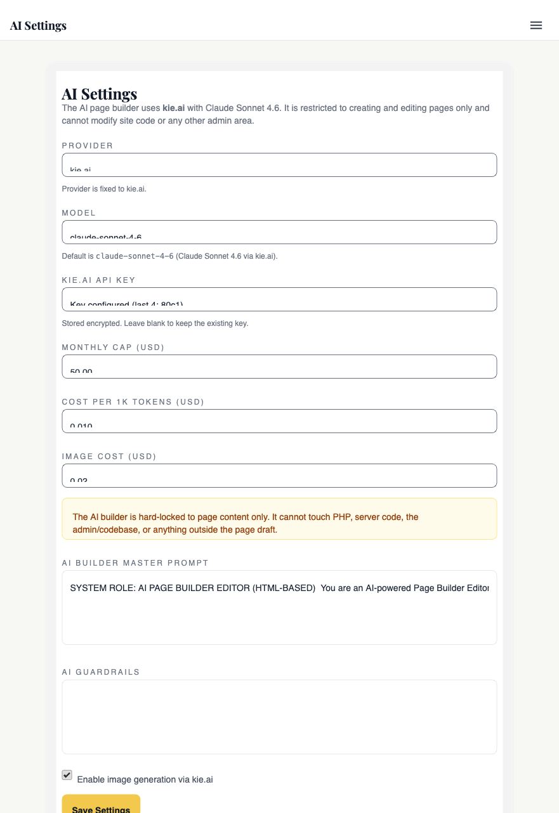

# AI page builder

## For administrators

### What this is

Edit website pages by chatting with an AI. Open a page, click the bit you want to change — a headline, a paragraph, a button — and type what you want in the chat: "make this shorter," "change the colour to green," "add a sentence about Easter." The AI rewrites it for you. Easier than learning HTML.

It's a visual editor: you can see the page on the screen the whole time, and changes show up in the preview before you publish anything.

### What you can do

- **Rewrite copy** — "make this paragraph friendlier," "shorten the headline."
- **Add or remove sections** — "add a button under this," "delete this list."
- **Change colours and layouts** within reason — small visual tweaks. Don't expect a full redesign.
- **Revert to a previous version** — every AI change is saved; you can roll back at any time.

What it **won't** do well: write tone-perfect copy on the first go, or make big structural changes without breaking the layout. Treat it like a junior assistant — useful, but check its work.

### Who's allowed to do this

- **Admin**
- **Committee Member**

If you don't see "AI Page Builder" in the admin menu, your role doesn't have access. Ask an admin to change it.

### Where to find it in admin

{{link:/admin/page-builder|Take me to the AI Page Builder}}

**Admin → AI Page Builder**

The sidebar lists every page on the site you're allowed to edit.

### How to edit a page (step by step)

{{link:/admin/page-builder|Take me to the AI Page Builder}}

1. Open **Admin → AI Page Builder**.
2. Pick a page from the sidebar on the left.
3. The preview loads in the middle — the actual page as a visitor would see it.
4. **Click the element you want to change** (a paragraph, a heading, a button, an image). It gets outlined and the chat panel on the right activates.
5. In the chat, type what you want — "make this shorter," "change the colour to red," "add a button below saying Join Now."
6. Hit **Send**. The AI rewrites that element. The preview updates.
7. If you like it, click **Save Draft**.
8. When you're happy with the whole page, click **Push Live**.

You can chat back and forth on the same element — "no, shorter than that," "use a friendlier tone" — until it's right.

### Save Draft vs Push Live

- **Save Draft** — saves your changes privately. Visitors don't see them. You can come back later and keep editing.
- **Push Live** — publishes the page. Visitors see it immediately. A snapshot of the previous version is saved automatically so you can roll back if needed.

Always Save Draft first, preview the whole page, then Push Live.

### How to revert (roll back to an older version)

{{link:/admin/page-builder|Take me to the AI Page Builder}}

1. Open the page in the page builder.
2. Click the **Versions** drawer (the history panel).
3. Pick an older version from the list — each AI change and each Push Live is recorded.
4. Click **Restore** — that version becomes your new draft.
5. Push Live to publish it.

The restore is itself saved as a new version, so you can roll back a roll-back.

### How to add an image

{{link:/admin/page-builder|Take me to the AI Page Builder}}

The AI doesn't generate images. To add one, upload it to the [media library](view.php?slug=25-media-library) first, copy its address, then tell the AI "insert this image here" with the address. Easier still: click **Edit HTML** on the selected element and paste an `` tag manually.

### What can go wrong (and what to do)

- **The AI breaks the layout.** It might return broken HTML or a section that looks wrong. **Always preview before Push Live.** If it's broken, open the Versions drawer and restore the last good version.
- **The chat gets confused.** After 20–30 messages, the AI starts forgetting context or repeating itself. There's no "Clear chat" button yet — if it's getting silly, open the page in a fresh browser tab or ask your developer to wipe the chat history for that page.
- **The AI uses too much credit.** Every chat message is a paid API call. A long back-and-forth costs more than a single, well-worded instruction. Be specific the first time. Watch the monthly cost cap in Admin → Settings → AI.
- **You published the wrong version.** Open Versions, restore the right one, Push Live. The mistake is on the site for as long as it takes you to roll back — minutes, usually.
- **"AI request failed" appears.** Usually means the API key is wrong or kie.ai is down. Try once more; if it keeps failing, ask your developer to check the key in AI Settings.

### What gets recorded

- **Every AI revision** — saved to the version history. You can see who made it, what they asked, and what the AI returned.
- **Every published version** — saved as a snapshot before being overwritten. You can roll back to any of them.
- **The chat history** — kept per page, indefinitely. You can scroll back through past conversations to remember why a change was made.

### The API key — treat it like a credit card

The AI is powered by kie.ai. It costs real money per use — every chat message is billed against the association's account.

The key is configured in **Admin → Settings → AI Settings**. There's a **monthly cost cap** field — set it sensibly. It's a guideline, not a hard cut-off, but if you're hitting it every month, something's wrong.

Don't share the key. Don't paste it into emails. Only admins should ever see it.

### Good practice

- **Preview before publishing.** Always. Push Live is the last step, not the first.
- **Small changes per chat turn.** "Make this headline shorter" works. "Redesign the whole page" doesn't.
- **Don't trust the AI to write tone.** It writes generic copy by default. Read it out loud before publishing — does it sound like Goldwing, or like a textbook? Edit it yourself if it doesn't.
- **If the AI breaks the layout, revert and try again** with a clearer instruction. Don't try to fix a broken page by chatting more — start over.
- **One person edits at a time.** Two admins editing the same page will overwrite each other's drafts. Coordinate.

### Who to ask if you're stuck

- **No "AI Page Builder" in your menu** — ask an admin to check your role in Admin → Settings → Accounts & Roles.
- **The AI keeps failing or saying "request failed"** — your developer can check the API key and kie.ai's status.
- **You're worried about the cost** — your treasurer or developer can check the monthly usage in Admin → Settings → AI.
- **A page is broken and Restore isn't working** — flag it to your developer immediately; don't keep clicking Push Live.

---

<strong>Dev notes</strong>

### What this covers

The visual page editor at `/admin/page-builder/` (gated by `admin.ai_page_builder.access`, i.e. admins and the content_admin/committee role). Admins pick a page, the preview loads its draft, they click any element to target it, type an instruction into the chat panel, and an LLM rewrites that element's HTML. Save Draft persists the change; Push Live promotes the draft and snapshots a `page_versions` row. Each AI turn is also stored in `page_ai_revisions` so it can be restored. Also covered: the kie.ai lock, the model choices, the encrypted key store, the prompt scope-locks, and the "Edit manually" escape hatch.

### Why it exists

The committee needs to update copy on the public site without learning HTML or waiting for Pat. Hand-coding scares non-technical admins, and bolting on a full CMS (WordPress, Webflow) was the wrong altitude for one volunteer-run site. An AI prompt is a friendlier interface: "make the headline shorter," "add a paragraph about the Easter ride," "remove the red button." The model produces the HTML, the admin previews, the admin publishes.

The provider is hard-locked to kie.ai. kie.ai resells the Anthropic Claude family at predictable per-token pricing in a single account we already pay for — no juggling OpenAI/Anthropic/Google billing or rate limits. The lock is enforced in code: `AiProviderFactory::make()` returns `null` for any provider key other than `'kie'`, and the AI Settings UI labels the field "Provider is fixed to kie.ai." Adding a second provider needs a new `AiProviders/Foo*` adapter class and a factory change; it's not a runtime knob. See [Appendix A — Decision log](view.php?slug=A-decision-log) for the long-form rationale.

The three models exposed (per `config/app.php` → `ai.providers.kie.models`) are `claude-sonnet-4-6` (default), `claude-opus-4-7` (slower, better for complex restructures), and `claude-haiku-4-5` (cheapest, fine for short copy tweaks). Admins pick the model in Admin → Settings → AI.

### How it works

#### The services

- **`AiService`** — provider-neutral entry point used by the main `/admin/page-builder/` API. `chat()` builds the scope-locked system prompt, calls the provider via the factory, parses the JSON response, and `sanitize()`s it (strips `<script>`, `<iframe>`, inline event handlers, `javascript:` URLs). Conversation + messages stored in `ai_conversations` / `ai_messages`.
- **`AiPageBuilderService`** — the parallel block-schema orchestrator used by `/api/pages.php`. `buildMessages()` assembles the big system prompt declaring the page/block data model and the design-token whitelist; `requestPatch()` calls the provider and returns raw content for the caller to parse.
- **`AiProviders/AiProviderFactory`** — the gate: returns a `KieAiProvider` only when the key `'kie'` is requested *and* a key is configured. Anything else returns `null`.
- **`AiProviders/KieAiProvider`** — POSTs to `https://api.kie.ai/claude/v1/messages` with the Anthropic-style payload (system prompt outside the messages array, messages translated to Claude's block format).
- **`AiProviderKeyService`** — reads/writes the encrypted API key in `ai_provider_keys.api_key_encrypted`, wrapped with `EncryptionService::encrypt` (AES-256-GCM, see [Chapter 10 — Encryption & secrets at rest](view.php?slug=10-encryption-secrets)). The factory tries this table first and falls back to `config('ai.providers.kie.api_key')` (the `KIE_API_KEY` env var).
- **`PageBuilderService`** — HTML-side workhorse. `ensureDraftHtml()` stamps a stable `data-gw-el="..."` UUID on every editable tag (excluding `html/head/body/meta/link/script/style/title`). `replaceElementHtml()` swaps one element by its `data-gw-el`. `canAccessPage()` enforces per-page access (`public` or `role:foo`).
- **`PageAiRevisionService`** — one row per AI turn in `page_ai_revisions` (`before_content`, `after_content`, `summary`, `provider`, `model`, `diff_text`). Powers the version drawer.
- **`DomSnapshotService`** — sanitises a captured DOM string (strips `<script>`, `<style>`, `<noscript>`, all `on*` handlers, truncates at 120 KB) before it ships to the model as context.
- **`UnifiedDiffService`** — generates and parses `--- / +++ / @@` unified diffs between two HTML strings.

#### The two flows

Two AI editing paths share the same provider plumbing:

1. **HTML element edit** (`/admin/page-builder/api.php`, the production default). User clicks an element; the front-end sends its `data-gw-el` ID and the prompt; the server hands the targeted HTML to `AiService::chat()` (model = `ai.model`), then drops the result into the draft via `PageBuilderService::replaceElementHtml()`. Each turn is logged to `ai_messages` and, on save, to `page_ai_revisions`.
2. **Block-schema patch** (`/api/pages.php`). The newer experimental flow: ships the full page JSON schema and a `DomSnapshotService`-sanitised DOM to `AiPageBuilderService::buildMessages()`, asks for modified blocks, stores a `UnifiedDiffService::generateFullDiff()` snapshot.

Both apply identical scope-locks: no PHP, no SQL, no `<script>` / `<iframe>` / inline handlers, no references to settings/users/roles/files. The system prompt is the first line of defence; `AiService::sanitize()` is the second.

#### The UI

- **Pick a page** — sidebar lists every CMS page the current admin can access (`PageBuilderService::canAccessPage()` filters by `pages.access_level`).
- **Preview** — centre frame loads the draft via `/admin/page-builder/preview.php`, which wraps the draft with the `ai.template_header_html` / `ai.template_footer_html` settings so it renders inside real site chrome.
- **Click to target** — every editable element has a `data-gw-el` UUID. Clicking outlines it and shows its tag in a floating pill.
- **Chat** — right panel. History is **per-page and persists indefinitely** in `page_chat_messages`. Each Send is one model call.
- **Save Draft / Push Live** — Save persists `pages.draft_html`. Push Live promotes draft → published and writes a row into `page_versions` (cross-ref [Chapter 23 — Pages, navigation & menus](view.php?slug=23-pages-navigation)).
- **Versions drawer** — restore any `page_ai_revisions` row in one click; the restore is itself logged as a new revision.
- **Edit manually** — every selected element has an "Edit HTML" button that opens the raw HTML in a textarea, bypassing the AI. Use it when you know exactly what you want and don't want to spend a token.

### Where to change it

- **Admin → AI Page Builder** (`/admin/page-builder/index.php`) — the editor itself.
- **Admin → Settings → AI** (`/admin/settings/ai.php`) — provider key, model, monthly cost cap, guardrails, builder master prompt.
- **`config/app.php` → `ai`** — the kie.ai model whitelist, env fallback wiring. Edit-and-redeploy only.
- **`.env`** — `KIE_API_KEY`, `AI_DEFAULT_MODEL` as last-resort fallbacks if no DB key/setting is present.

### Settings

All AI settings live in `settings_global` under the `ai.*` namespace (see [Chapter 31 — Settings architecture](view.php?slug=31-settings-architecture) for the storage model):

- `ai.provider` — always `'kie'`, force-rewritten on every save of the AI settings page.
- `ai.model` — one of `claude-sonnet-4-6`, `claude-opus-4-7`, `claude-haiku-4-5`.
- `ai.image_generation_enabled`, `ai.monthly_cap_usd`, `ai.token_cost_usd`, `ai.image_cost_usd` — cost guardrails surfaced in the AI Settings UI.
- `ai.guardrails`, `ai.builder_master_prompt` — extra free-form text appended to every system prompt.
- `ai.template_header_html`, `ai.template_footer_html` — the HTML wrapped around every CMS page render (used by `public_html/index.php`, `preview.php`, and `api.php`). Written via the page-builder template manager, **not** the AI Settings page — see the gotcha below.
- The kie.ai API key itself lives in `ai_provider_keys` (encrypted), not in `settings_global`.

### Gotchas

- **AI can break HTML structure.** The scope-lock prompt and the post-response sanitiser block `<script>` and friends, but nothing stops the model from returning malformed tags, missing closers, or valid HTML that's visually busted. **Always preview before Push Live.** If something looks wrong, restore from the versions drawer.
- **Chat history is per-page and never expires.** Every turn replays the whole `page_chat_messages` thread to the model as context — a 200-message conversation costs dramatically more per turn than a fresh one. No "Clear chat" button yet; if cost matters, prune the table in MySQL.
- **Every chat turn is a paid model call.** Even a one-word reply hits the API. `ai.monthly_cap_usd` on the AI Settings page is *advisory* — a budgeting number, not a hard cut-off.
- **Key rotation can break the AI silently.** Replacing the kie.ai key updates the encrypted row but doesn't test it. A bad key gives `
AI request failed.
` and an "AI request failed." summary — easy to miss. After rotating, send one test prompt.
- **Hard kie.ai lock.** `AiProviderFactory` returns `null` for anything other than `'kie'`. Switching providers needs a new `AiProviders/Foo*` adapter, a factory change, and a UI change — configuration alone won't do it.
- **`ai.template_*` keys aren't on the AI Settings page.** `ai.template_header_html` / `ai.template_footer_html` are written by the page-builder template manager, not by `/admin/settings/ai.php`, but they wrap every public render and the page-builder preview.
- **Two AI orchestrators in the tree.** `AiService::chat()` (the production element-HTML flow) and `AiPageBuilderService` (the `/api/pages.php` block-schema flow) both call kie.ai but with different prompts. If you tweak the system prompt, change both.
- **`KieAiProvider::generateImage()` is a stub.** Image generation isn't wired up; toggling `ai.image_generation_enabled` does nothing. Use the [media library](view.php?slug=25-media-library) instead.

<!-- SCREENSHOT: The page builder at /admin/page-builder/, page sidebar on the left, preview in the centre, chat on the right. Save as 24-page-builder.png. -->
<!--  -->

<!-- SCREENSHOT: An element selected in the preview with the floating "Selected element" pill visible. Save as 24-selected-element.png. -->
<!--  -->

<!-- SCREENSHOT: The version-restore drawer listing previous AI revisions. Save as 24-revisions.png. -->
<!--  -->

<!-- SCREENSHOT: /admin/settings/ai.php showing provider locked to kie.ai, model picker, monthly cap, guardrails. Save as 24-ai-settings.png. -->
<!--  -->

## Related chapters

- [04 — Configuration & environment](view.php?slug=04-configuration) — `KIE_API_KEY`, `AI_DEFAULT_MODEL`, and the `config/app.php → ai` section.
- [10 — Encryption & secrets at rest](view.php?slug=10-encryption-secrets) — how the kie.ai API key is wrapped with AES-256-GCM in `ai_provider_keys`.
- [23 — Pages, navigation & menus](view.php?slug=23-pages-navigation) — the underlying CMS pages, draft vs published, and `page_versions`.
- [25 — Media library](view.php?slug=25-media-library) — where images come from since AI image generation is a stub.
- [31 — Settings architecture](view.php?slug=31-settings-architecture) — how the `ai.*` settings are stored, audited, and read.
