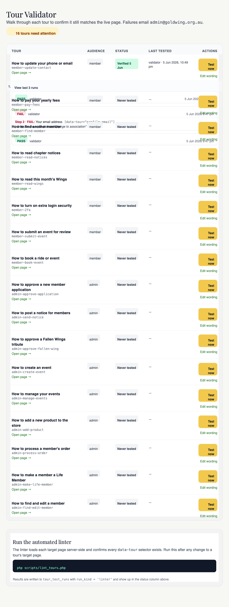

# Tours system

## For administrators

### What this is

The yellow **?** button that walks users through a feature. Tours are short interactive walkthroughs that pop up on a page, highlight a button or field, and explain what to click next.

On any member or admin page that has tours available, a circular yellow **?** button sits in the bottom-right corner. Click it, pick a tour from the list, and the page lights up step-by-step — "click here, then here, then here" — with a short explanation at each stop.

### Why they exist

Members are mostly retirees and admins are volunteers. Neither group wants to read a PDF manual to figure out how to pay their yearly fees or approve a new application. Tours put help *inside* the page — the walkthrough literally points at the button you need next — so people can learn the site without external docs, training calls, or hand-overs.

### What you can do

- **Edit the wording** of an existing tour — fix awkward phrasing, clarify a step, correct a typo. No deploy needed.
- **Report a broken tour** — when you spot one whose highlight lands on the wrong thing, flag it from the validator so the developer sees it.
- **Mark tours as verified after a deploy** — walk through the affected tours and tick "Looks right" or "Wrong / confusing" at each step.

### Who's allowed

Editing tour wording and using the Tour Validator are restricted to:

- **Admin**
- **Webmaster**

Anyone logged in (members and admins alike) can *see* and *run* tours on pages they have access to.

### Where to find them

{{link:/admin/help/validator.php|Take me to the Tour Validator}}

- **As an end-user (member or admin):** the yellow **?** button in the bottom-right of any page. Click it → pick a tour from the menu → follow the walkthrough.
- **As an admin to edit text:** Admin → Tour Validator → click **Edit wording** next to a tour.
- **As an admin to verify after deploy:** Admin → Tour Validator → click **Test now** on each tour you want to check.

### The Tour Validator workflow

{{link:/admin/help/validator.php|Take me to the Tour Validator}}

The Tour Validator (Admin → Tour Validator) lists every tour in the system with a status badge:

- **Verified** — recently walked through and confirmed working.
- **Stale** — was verified, but more than 60 days ago.
- **Partial** — some steps confirmed, others not.
- **Fail** — last person to test it flagged a step as wrong or confusing.
- **Never tested** — nobody's walked it yet.

When the sidebar shows a **number badge** next to "Tour Validator", that's the count of tours needing attention (failing, never tested, or stale). The badge is a gentle nag — it doesn't block anything, but a forgotten tour will eventually nudge somebody to look at it.

### How to edit a tour's wording

{{link:/admin/help/edit.php|Take me to the Tour wording editor}}

1. Admin → **Tour Validator**.
2. Click **Edit wording** next to the tour you want to change.
3. Edit any step's title or description.
4. Click **Save draft** — your change is saved but not live yet.
5. Click **Preview** to walk the tour with your draft text, so you can see how it reads in context.
6. When you're happy, click **Publish all** to make every draft step live for everyone.

No code deploy is required. Members and admins see your new wording the next time they open the tour.

You can also publish a single step on its own if you only changed one — "Publish all" is just the shortcut for "every draft I have open".

### What can go wrong

- **Tour highlights the wrong element.** A developer renamed or moved a button and the tour's pointer now lands on the wrong thing (or nothing). Flag it in the validator as "Wrong / confusing" — the developer gets emailed.
- **Tour skips a step.** Same root cause: the element the step expected isn't there anymore, so Driver.js silently jumps to the next one. Again, flag it.
- **Tour wording is stale.** The page still works but the description references a button that was renamed, or steps the user through a flow that's changed. Edit the wording yourself — no developer needed.
- **Tour selector "drift" after a refactor.** Whenever a developer renames things in the underlying page, tours that targeted those things can quietly break. This is exactly what the "Test now" button is for after a deploy.

### Good practice

- **Test affected tours after each deploy.** When the sidebar badge shows a number, work through the list. Five minutes now beats a member email next week.
- **Keep tour wording short and action-oriented.** "Click **Pay now** to start paying this year's fee" reads better than "This button is where you can begin the process of submitting payment for your annual membership dues."
- **Tag broken tours with "Wrong / confusing".** That's the signal the developer watches for — they get an email and can fix the underlying selector. Don't just leave a failing tour with no flag.
- **Don't be afraid to publish small wording fixes.** A typo fix is a 30-second job and lives entirely in the database — no risk of breaking anything in code.

### Who to ask if you're stuck

- **A tour's pointer is on the wrong thing** — the **developer**. They own the page selectors. Flag it as "Wrong / confusing" in the validator and they'll be emailed.
- **You can't see the Tour Validator** — you're not an Admin or Webmaster. Ask a site admin to check your role.
- **The "?" button doesn't appear on a page** — there are simply no tours for that page yet. Ask the developer to add one if you think there should be.

---

<details>
<summary><strong>Dev notes</strong></summary>

## What this covers

The guided-tour system: in-app, step-by-step walkthroughs that highlight a UI element, explain it in plain English, and move the user to the next thing. Tours are how members learn to pay their fees or set up 2FA without reading a manual, and how admins learn to approve an application or process an order without a hand-over call. The engine is [Driver.js](https://driverjs.com), wrapped in a tiny Goldwing layer that reads `config/tour-manifest.json`, pulls per-step wording out of the database, gates tours by audience/role, and records completions and test runs.

## Why it exists

The site has grown to ~70 services, two member portals, a store, a calendar, and a Settings Hub. Members are mostly retirees, admins are volunteers — neither wants to read a PDF manual. External docs (Notion) went stale within a week; tooltips were only discoverable after you'd already found the button.

Tours solve both: help is *inside* the page, walks you to the next click, and the wording lives in the database so a non-developer admin can fix awkward phrasing without a deploy. The same pattern was then borrowed for this very documentation system — see the `doc-sync-check` parallel in the Gotchas.

## How it works

### The manifest is the source of truth

Every tour is declared in [`config/tour-manifest.json`](../../../../config/tour-manifest.json). One entry per tour:

```json
"member-pay-fees": {
  "slug": "member-pay-fees",
  "name": "How to pay your yearly fees",
  "blurb": "Show me how to pay this year's membership fee.",
  "audience": "member",
  "roles": ["member", "area_rep", "store_manager", "admin"],
  "page_url": "/member/index.php?page=billing",
  "page_match": "page=billing",
  "steps_file": "/assets/js/tours/tours/member-pay-fees.js",
  "selectors": ["[data-tour=\"pay-fees-pay-now\"]", "…"],
  "watched_files": ["public_html/member/index.php", "…"]
}
```

PHP (`TourService`, the validator, the linter, the impact check) and JavaScript (the tour engine) both read this file. There is no second list anywhere.

- `audience` — `member` (visible to everyone logged in) or `admin` (hidden from plain members).
- `roles` — finer-grained gate; the tour only appears if the user holds at least one role from this list.
- `page_match` — substring matched against the current URL to decide which tours the "?" button offers on this page.
- `selectors` — every `data-tour="..."` attribute the tour expects to find. The linter walks this list.
- `watched_files` — files that, if changed, may break the tour. The impact check walks this list.

### The engine

Loaded lazily on member/admin pages from `public_html/assets/js/tours/`:

- `driver.js.iife.js` — the vendored Driver.js build.
- `tour-engine.js` — Goldwing wrapper exposing `window.GoldwingTours.run(slug)` and `runInValidator(slug)`. Reads the manifest, fetches step JSON via `api_steps.php`, calls Driver.js with senior-friendly config (larger pop-overs, "Next" / "Done" instead of icons), and posts to `api_complete.php` when the user finishes.
- `tours/<slug>.js` — one file per tour. These were the original wording source; today they're skeleton fallbacks — real wording lives in the DB.

### DB-backed step wording

Step text used to be hardcoded in the `tours/*.js` files. That meant a typo took a deploy to fix. The current shape stores each step as a row in `tour_steps` with both a published version and an optional draft, served by `TourService::stepsFor($slug)` (see [`app/Services/TourService.php`](../../../../app/Services/TourService.php)):

- `title`, `description`, `side`, `align`, `element_selector` — what's live.
- `draft_*` columns + `has_draft` flag — what an admin has edited but not yet published.
- Admin preview mode (`includeDrafts=true`) overlays drafts so editors can walk their own changes before publishing.

### The "?" floating button

On every member and admin page that has at least one tour for the current URL, a circular question-mark button appears in the bottom-right. Clicking it opens a sheet listing the matching tours (`TourService::toursFor($user, $pageMatch)`), each with its `name` and `blurb`. Pick one → engine starts → user walks the page.

### Completions

Each time `api_complete.php` fires, `TourService::markCompleted($userId, $slug)` upserts into `tour_completions(user_id, tour_slug, completed_at)`. The "?" menu shows a tick beside tours the current user has already finished, but doesn't hide them — repeating a tour is allowed.

### The Tour Validator (admin)

At `/admin/help/validator.php`, admins see every tour in the manifest with its latest status badge: **Verified**, **Stale** (verified more than 60 days ago — `TourService::STALE_AFTER_DAYS`), **Partial**, **Fail**, or **Never tested**. "Test now" opens the target page with `?gw_tour_validator=<slug>`, which loads the engine in validator mode — a thin top bar lets the admin click "Looks right" or "Wrong / confusing" at each step. The result is written to `tour_test_runs` via `TourService::recordRun()` and (on failure) emailed to the support address.

### Attention badges

`TourService::attentionCount()` returns the number of tours that are failing, never tested, or stale. The admin sidebar reads this and shows a small amber pip beside the Help link so a forgotten tour eventually nags somebody.

## Where to change it

- **Add a new tour:** edit `config/tour-manifest.json`, drop a skeleton file at `public_html/assets/js/tours/tours/<slug>.js`, add `data-tour="..."` attributes to the target page, and insert the step rows (a seed fixture in `database/` handles bulk seeds). Then commit and push.
- **Tweak existing tour wording:** admin only, at `/admin/help/edit.php?slug=<slug>`. Edit any step → "Save draft" → preview → "Publish all". No deploy required.
- **Adjust who sees a tour:** change `audience` / `roles` in the manifest, commit, push.
- **Re-record a tour status after fixing it:** open the validator and click "Test now".

## Settings

The tours system has no entries in `settings_global` — its config is the manifest plus DB tables. The one related setting is:

- `site.support_email` — where validator "Wrong / confusing" reports are emailed. Lives under Settings → General.

Stale-after window (60 days) is a `public const` on `TourService`, not a setting. Change it in code if needed; nobody's asked.

## Gotchas

- **Driver.js does not auto-detect a removed step.** If you delete a `data-tour="..."` attribute, the matching step will silently fail to attach and the tour skips forward — users see the next step glued to the wrong element. The only safety nets are `scripts/lint_tours.php` (CI / pre-commit) and the impact check.
- **Selectors must be `data-tour="..."` attributes.** Don't anchor steps to CSS classes or IDs — those move under refactors. The lint script only walks `data-tour`.
- **The impact check is informational, not a gate.** `scripts/check_tour_impact.php` exits with code `2` when a watched file changed, but nothing blocks the commit. The skill `tour-impact-check` runs before every push to surface the list; you're expected to revalidate flagged tours via the validator after deploy.
- **The doc-sync-check skill is the same shape.** It reads `public_html/admin/help/docs/_toc.json` instead of the tour manifest, flags affected chapters instead of tours, and points editors at `chapters/*.md` instead of the validator. This whole documentation system you're reading right now is the tour pattern applied to prose.
- **Chapter-scoped roles see only their tours.** A `store_manager` only sees tours that list `store_manager` in `roles`. If you add a tour aimed at store managers, remember to include them — otherwise it'll be invisible to the people who need it.
- **Drafts overlay the published version per step, not per tour.** You can publish a single step independently; "Publish all" just collapses every step's draft into its published columns.

</details>

<!-- SCREENSHOT: The "?" floating button on a member page (e.g. /member/index.php?page=billing). Capture bottom-right corner. Save as 36-tour-help-button.png. -->
<!--  -->

<!-- SCREENSHOT: A Driver.js pop-over mid-tour highlighting a button. Save as 36-tour-overlay.png. -->
<!--  -->

<!-- SCREENSHOT: The Tour Validator at /admin/help/validator.php showing the status table. Save as 36-tour-validator.png. -->
<!--  -->

<!-- SCREENSHOT: The wording editor at /admin/help/edit.php?slug=member-pay-fees with a draft mid-edit. Save as 36-tour-editor.png. -->
<!--  -->

## Related chapters

- [02 — Codebase map](view.php?slug=02-codebase-map) — where `TourService`, the engine, and the admin help pages live.
- [33 — Deployment](view.php?slug=33-deployment) — the "push live" flow runs `tour-impact-check` and `doc-sync-check` before Pat is given a SHA to deploy.
- [35 — Logs & troubleshooting](view.php?slug=35-logs-troubleshooting) — completion and validator runs aren't in the app log; they're in the `tour_completions` and `tour_test_runs` tables.
- [System Documentation TOC](index.php) — the docs you're reading. Same impact-check pattern, different watch list.
